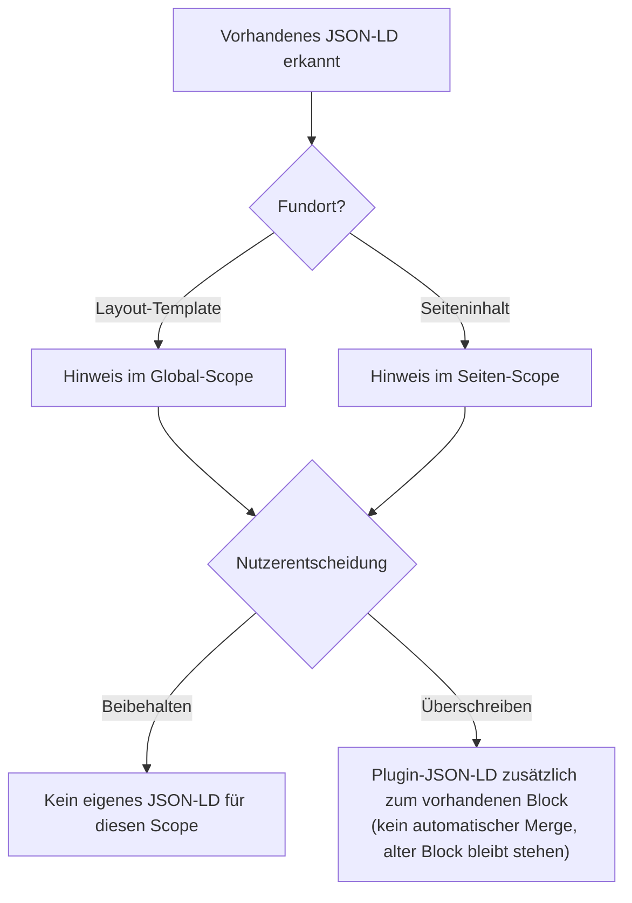
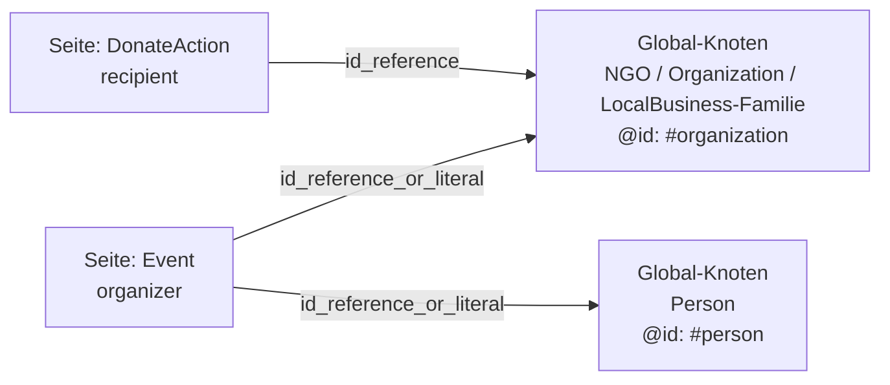

# schemaOrgData — moziloCMS Plugin

**Strukturierte Daten ohne SEO-Agentur.** `schemaOrgData` macht die Inhalte
einer moziloCMS-Website für Suchmaschinen eindeutig interpretierbar: wer hinter
der Website steht (Unternehmen, Praxis, Kanzlei, Verein), was angeboten wird und
welche Seiten besondere Inhalte tragen — Veranstaltungen, Stellenanzeigen,
Spendenaufrufe, FAQ. Das erhöht die Chance auf **Rich Results** in der
Google-Suche und verbessert die maschinelle Auswertbarkeit der Website insgesamt.
Technisch geschieht das über validiertes, Schema.org-konformes **JSON-LD**, das
vollständig im Admin-Bereich über Formulare gepflegt wird: kein Eingriff in
Templates nötig (bis auf einen einmalig zu setzenden Platzhalter), keine
Code-Kenntnisse erforderlich, client- und server-seitige Validierung inklusive.


[](https://www.gnu.org/licenses/gpl-3.0)

Das Plugin arbeitet **konfigurationsgetrieben**: Die strukturierten Daten
werden im Admin-Bereich über Formulare gepflegt und nicht automatisch aus dem
Seiteninhalt abgeleitet. Für die typische moziloCMS-Website (überschaubare
Seitenzahl, ein Betreiber) ist das der passende Zuschnitt — volle Kontrolle
über die Ausgabe, kein Mapping-Setup nötig. Es ergänzt dabei die im
moziloCMS-Core bereits vorhandenen Microdata-Implementierungen um
maschinenlesbare JSON-LD-Blöcke (siehe
[Abgrenzung zu bestehenden Core-Implementierungen](#abgrenzung-core)).

---

## Inhaltsverzeichnis

<details>
<summary>Inhaltsverzeichnis anzeigen</summary>

- [Features](#features)
  - [Unterstützte Schema-Types](#unterstuetzte-schema-types)
- [Voraussetzungen und Kompatibilität](#voraussetzungen-und-kompatibilitaet)
  - [Abgrenzung zu bestehenden Core-Implementierungen](#abgrenzung-core)
- [Installation](#installation)
- [Erste Konfiguration](#erste-konfiguration)
- [Nutzung im Alltag](#nutzung-im-alltag)
  - [Geltungsbereiche und Vererbung](#geltungsbereiche-und-vererbung)
  - [JSON-LD-Ausgabe im Detail](#json-ld-ausgabe-im-detail)
  - [Adressschema (PostalAddress)](#adressschema-postaladdress)
  - [Öffnungszeiten](#oeffnungszeiten)
  - [Erweiterungsfeld (erweiterte Properties)](#erweiterungsfeld)
  - [Mehrsprachigkeit](#mehrsprachigkeit)
  - [Vorhandenes JSON-LD und Import](#vorhandenes-json-ld-und-import)
  - [Debug-Modus](#debug-modus)
- [Use Cases und Beispiele](#use-cases-und-beispiele)
  - [Lokales Unternehmen](#lokales-unternehmen)
  - [Organisations-Identität und @id-Anker](#organisations-identitaet)
  - [Verknüpfte Inhalte (Widgets)](#verknuepfte-inhalte)
  - [Event](#use-case-event)
  - [FAQPage](#use-case-faq)
  - [JobPosting](#use-case-jobposting)
  - [DonateAction](#use-case-donateaction)
- [Validierung und Best Practices](#validierung-und-best-practices)
  - [Formularvalidierung](#formularvalidierung)
  - [Best Practices: Schema.org-Daten sinnvoll pflegen](#best-practices)
  - [Typische Fehler — so bitte nicht](#typische-fehler)
- [Sicherheit](#sicherheit)
- [Entwicklerdokumentation](#entwicklerdokumentation)
- [Tests](#tests)
- [Changelog](#changelog)

</details>

---

<a id="features"></a>
## Features

**Architektur**
- JSON-LD-Ausgabe im `<head>` der Seite, nicht im Seiteninhalt
- **14 unterstützte Schema-Types** (LocalBusiness, Organization, Event, JobPosting, FAQPage u. a. — [vollständige Liste](#unterstuetzte-schema-types))
- Drei Geltungsbereiche: **Global**, **Kategorie**, **Seite**, mit feldweiser Vererbung (Global → Kategorie → Seite, siehe [Geltungsbereiche und Vererbung](#geltungsbereiche-und-vererbung))

**Redaktion & Bedienung**
- Vollständig über Admin-Formulare pflegbar — kein Templating-Wissen nötig
- Öffnungszeiten-Widget (inkl. optionalem zweitem Zeitraum je Wochentag, z. B. für Mittagspausen)
- Generisches `PostalAddress`-Schema nach schema.org (international einsetzbar)
- **Erweiterungsfeld** (JSON-Textarea) für zusätzliche Properties mit Live-Validierung
- **Erkennung vorhandener JSON-LD-Blöcke** in Template und Seiteninhalt, wahlweise Beibehalten oder Überschreiben — plus **Import-Feld** zur Übernahme bestehender Daten ins Formular
- **Debug-Modus**: erzeugte JSON-LD-Blöcke im Frontend als Pop-up anzeigen (zum Abgleich mit validator.schema.org)
- Mehrsprachige Admin-Oberfläche und Frontend-Ausgabe

**Datenqualität**
- Validierung via **[AJV.js](https://ajv.js.org/)** (lokal ausgeliefert, kein CDN) client-seitig, plus eigenständige server-seitige Validierung beim Speichern (unabhängig von JavaScript)
- Umfangreiche automatisierte PHPUnit-Test-Suite (siehe [docs/tests.md](docs/tests.md))

**Für Entwickler**
- **Schema-getriebenes Formular**: JSON-Schema-Dateien definieren sowohl Validierungsregeln als auch Formularfelder — kein hardcodiertes PHP für die meisten Types (siehe [Entwicklerdokumentation](#entwicklerdokumentation))
- **@id-Anker und Knotenreferenzen**: Seiten-Typen (z. B. **DonateAction**, **Event**) verweisen per `@id` auf global definierte Identitätsknoten — inkl. Schutzmechanismen gegen doppelte und hängende Referenzen (siehe [Organisations-Identität und @id-Anker](#organisations-identitaet))

<a id="unterstuetzte-schema-types"></a>
### Unterstützte Schema-Types

<details>
<summary>Tabelle: alle unterstützten Schema-Types anzeigen</summary>

| Type | Beschreibung | Geltungsbereich |
|---|---|---|
| `LocalBusiness` | Lokales Unternehmen | Global / Kategorie |
| `ProfessionalService` | Dienstleister | Global / Kategorie |
| `LegalService` | Anwaltskanzlei / Rechtsberatung (LocalBusiness-Subtyp) | Global / Kategorie |
| `MedicalBusiness` | Arztpraxis / medizinische Einrichtung (LocalBusiness-Subtyp) | Global / Kategorie |
| `AccountingService` | Steuerberatung / Buchhaltung | Global / Kategorie |
| `Organization` | Organisation / Firma, mit `@id`-Anker `#organization` | Global |
| `NGO` | Gemeinnützige Organisation (Verein, Stiftung u. a.), mit `@id`-Anker `#organization` | Global |
| `Person` | Einzelperson, mit `@id`-Anker `#person` | Global |
| `WebSite` | Website-Metadaten | Global |
| `FAQPage` | Häufig gestellte Fragen ([Google-Richtlinien beachten](https://developers.google.com/search/docs/appearance/structured-data/faqpage) — Rich Results seit 2023 auf wenige autoritative Quellen beschränkt) | Kategorie / Seite |
| `Article` | Artikel / Blogbeitrag | Kategorie / Seite |
| `JobPosting` | Stellenanzeige | Seite |
| `DonateAction` | Spendenaufruf (verknüpft per `@id` mit dem globalen Org-Knoten) | Seite |
| `Event` | Veranstaltung / Termin (`location` als `Place` mit Adresse, `organizer` wahlweise als Referenz oder Direkteingabe) | Seite |

</details>

Details und Konfigurationsbeispiele zu einzelnen Types stehen unter
[Use Cases und Beispiele](#use-cases-und-beispiele). Welche Zusatzfelder
Google für Rich Results je Type zusätzlich zur schema.org-Spec verlangt,
zeigt die [Google Search Gallery](https://developers.google.com/search/docs/appearance/structured-data/search-gallery).

---

<a id="voraussetzungen"></a>
<a id="kompatibilitaet"></a>
<a id="voraussetzungen-und-kompatibilitaet"></a>
## Voraussetzungen und Kompatibilität

- moziloCMS 3.0.4 oder höher
- PHP 8.1+
- Schreibzugriff auf den Plugin-Ordner (für `plugin.conf.php`, siehe [Installation](#installation))
- Kein weiteres Plugin erforderlich
- AJV.js wird lokal ausgeliefert (kein externes CDN)
- Kompatibel mit `seo_urls`-Plugin (optional): kanonische URLs aus
  `seo_urls` können manuell als `url`-Property eingetragen werden

> 📄 Vertiefung: [docs/compatibility.md](docs/compatibility.md) · [docs/dependencies.md](docs/dependencies.md)

<a id="abgrenzung-core"></a>
### Abgrenzung zu bestehenden Core-Implementierungen

moziloCMS 3.0 enthält bereits Schema.org-Implementierungen als Microdata
(u. a. `Article`-Wrapper, `ImageObject`, `BreadcrumbList`, `LocalBusiness`
im Body). Dieses Plugin **ersetzt** diese Core-Microdata nicht, sondern
**ergänzt** sie um JSON-LD im `<head>`, das von Google und anderen
Suchmaschinen für Rich Results bevorzugt ausgewertet wird.

> 📄 Vertiefung (Tabelle im Detail): [docs/compatibility.md](docs/compatibility.md#abgrenzung-core)

---

<a id="installation"></a>
## Installation

1. Die Installation erfolgt über die moziloCMS-Admin-Oberfläche der
   Plugin-Verwaltung (ZIP-Upload).
2. Im moziloCMS-Admin unter **Plugins** aktivieren
3. **Wichtig:** Den Platzhalter `{schemaOrgData}` an passender Stelle im
   `<head>`-Bereich des aktiven Layout-Templates (`template.html`) ergänzen —
   **ohne diesen Platzhalter gibt das Plugin im Frontend keinerlei JSON-LD
   aus**, unabhängig von der Konfiguration. Fehlt der Platzhalter, zeigt der
   Admin-Bereich einen entsprechenden Hinweis an. In `gallerytemplate.html`
   sollte der Platzhalter nicht gesetzt werden (siehe
   [JSON-LD-Ausgabe im Detail](#json-ld-ausgabe-im-detail)).
4. Konfiguration unter **Plugins → schemaOrgData** vornehmen (siehe
   [Erste Konfiguration](#erste-konfiguration))

> ⚠️ **`plugin.conf.php` ist zugleich Metadaten-Datei und alleiniger
> Speicherort der kompletten Live-Konfiguration** (alle drei Geltungsbereiche
> in einer Datei). Ein Deploy dieser Datei per FTP auf einen Server mit
> bereits bestehender Konfiguration **überschreibt diese vollständig, ohne
> Rückfrage**. Ein Update über die moziloCMS-Admin-Oberfläche (ZIP-Upload)
> ist davon nicht betroffen — der Core-Installer überspringt
> `plugin.conf.php` beim Entpacken, falls die Datei bereits existiert. Wer
> stattdessen manuell per FTP aktualisiert, sollte `plugin.conf.php` gezielt
> von der Übertragung ausnehmen.

---

<a id="erste-konfiguration"></a>
## Erste Konfiguration

Nach der Installation ist noch keine Ausgabe konfiguriert — das Plugin gibt
so lange kein JSON-LD aus, bis mindestens ein Geltungsbereich einen
Schema-Type zugewiesen bekommen hat.

1. **Geltungsbereich wählen.** Im Admin-Bereich zunächst **Global**
   auswählen — diese Ebene wird auf jeder Seite ausgegeben (siehe
   [Geltungsbereiche und Vererbung](#geltungsbereiche-und-vererbung)).
2. **Identität festlegen.** Für die globale Ebene genau einen
   Identitäts-Type wählen, der zur Website passt: **Organization**, **NGO**,
   **Person** oder einen **LocalBusiness**-Typ (siehe
   [Organisations-Identität und @id-Anker](#organisations-identitaet) sowie
   [Best Practices](#best-practices) — „Global nur die Identität").
3. **Pflichtfelder ausfüllen.** Pflichtfelder sind im Formular markiert;
   Live-Validierung zeigt Fehler und Warnungen sofort an (siehe
   [Formularvalidierung](#formularvalidierung)).
4. **Speichern und prüfen.** Nach dem Speichern zeigt der Admin-Bereich eine
   Erfolgs- oder Fehlermeldung. Zur Kontrolle der tatsächlichen Ausgabe
   **Debug-Modus** aktivieren (siehe [Debug-Modus](#debug-modus)) und das
   erzeugte JSON-LD mit [validator.schema.org](https://validator.schema.org)
   abgleichen.
5. **Weitere Ebenen bei Bedarf.** Für Kategorien oder einzelne Seiten mit
   eigenem Inhalt (Event, FAQ, Stellenanzeige, Spendenaufruf …) analog auf
   Kategorie- bzw. Seiten-Ebene fortfahren — siehe
   [Use Cases und Beispiele](#use-cases-und-beispiele) für konkrete
   Konfigurationsbeispiele je Type.

---

<a id="nutzung-im-alltag"></a>
## Nutzung im Alltag

<a id="geltungsbereiche-und-vererbung"></a>
### Geltungsbereiche und Vererbung

Das Plugin kennt drei Konfigurationsebenen:

```
Global      → wird auf jeder Seite ausgegeben
Kategorie   → wird zusätzlich auf allen Seiten der Kategorie ausgegeben
Seite       → wird zusätzlich nur auf dieser einzelnen Seite ausgegeben
```

Beim Seitenaufbau werden alle zutreffenden Ebenen geladen und
zusammengeführt — die spezifischere Ebene überschreibt die allgemeinere,
und zwar feldweise: leere Felder der spezifischeren Ebene übernehmen den
Wert der übergeordneten Ebene, gefüllte Felder überschreiben ihn.
Verschachtelte Felder (z. B. `address`, `openingHours`) werden dabei nicht
innerhalb des Objekts gemergt — hier gewinnt die Ebene mit dem gefüllten
Objekt vollständig.

**Ausschlussliste.** Im Admin-Bereich kann der Nutzer Kategorien definieren,
auf denen die globale Ausgabe **nicht** erfolgt — z. B. Impressum,
Datenschutz, Sitemap. Eine eigenständige Konfiguration der Kategorie oder
ihrer Seiten ist davon nicht betroffen.

> 📄 Vertiefung (Type-Kollision im Detail, Settings-API, `plugin.conf.php`): [docs/configuration.md](docs/configuration.md)

<a id="json-ld-ausgabe-im-detail"></a>
### JSON-LD-Ausgabe im Detail

Das Plugin gibt das JSON-LD ([json-ld.org](https://json-ld.org/)) als
`<script>`-Tag im `<head>` aus — an der Stelle, an der im Layout-Template
der Platzhalter `{schemaOrgData}` steht (siehe [Installation](#installation)):

```html
<script type="application/ld+json">
{
  "@context": "https://schema.org",
  "@type": "LocalBusiness",
  "name": "Muster GmbH",
  "url": "https://www.example.com",
  "address": {
    "@type": "PostalAddress",
    "streetAddress": "Musterstraße 12",
    "postalCode": "12345",
    "addressLocality": "Musterstadt",
    "addressCountry": "DE"
  },
  "openingHours": ["Mo-Fr 09:00-18:00", "Sa 10:00-14:00"]
}
</script>
```

Pro Geltungsbereich wird ein eigener `<script>`-Block ausgegeben (Global +
Kategorie + Seite = bis zu drei Blöcke). Leere Felder werden vor der
Ausgabe entfernt; vollständig leere Knoten werden gar nicht ausgegeben.

> 📄 Vertiefung (gallerytemplate-Sonderfall, Types nur auf Globalebene,
> De-Dup-Verhalten (Duplikat-Vermeidung), weitere Ausgabe-Beispiele):
> [docs/rendering.md](docs/rendering.md) · [docs/examples/](docs/examples/)

<a id="adressschema-postaladdress"></a>
### Adressschema (PostalAddress)

Das Adressfeld folgt exakt `schema.org/PostalAddress` und ist international
ausgelegt: Straße, Postleitzahl, Ort, Region und Land — nur **Ort** und
**Land** sind Pflicht. Das Feld **Land** wird als Select-Box mit Klarnamen
dargestellt (z. B. „Deutschland"), intern wird der
**ISO-3166-1-alpha-2-Code** gespeichert (z. B. `DE`, Standard-Vorauswahl:
Deutschland). Die Länderliste ist in der zugehörigen JSON-Schema-Datei als
`enum` definiert und dort pflegbar.

> 📄 Vertiefung (Formularfelder im Detail): [docs/rendering.md](docs/rendering.md)

<a id="oeffnungszeiten"></a>
### Öffnungszeiten

Das Öffnungszeiten-Widget bildet die sieben Wochentage als Zeitraum-Felder
ab (Von / Bis, plus optionalem zweiten Zeitraum je Tag, z. B. für eine
Mittagspause). Leere Felder werden als „geschlossen" interpretiert. Intern
werden die Werte als `openingHours`-Array nach schema.org-Notation
gespeichert (Beispiel siehe [JSON-LD-Ausgabe im
Detail](#json-ld-ausgabe-im-detail) oben). Es wird ausschließlich das
**24-Stunden-Format** (`HH:MM`) unterstützt.

> 📄 Vertiefung (Regeln für den zweiten Zeitraum): [docs/rendering.md](docs/rendering.md)

<a id="erweiterungsfeld"></a>
### Erweiterungsfeld (erweiterte Properties)

Jede Konfiguration enthält optional ein JSON-Textarea-Feld für Properties,
die das Formular nicht abbildet. Die Inhalte werden beim Speichern mit den
Formularfeldern zusammengeführt (merge). Das Formular hat Vorrang bei
gleichnamigen Properties.

Die Validierung erfolgt zweistufig — client-seitig live per AJV.js
(Syntax, Property-Whitelist gegen das aktive JSON-Schema, Format-Prüfung
bekannter Properties) und server-seitig in PHP beim Speichern
(`json_decode()` sowie inhaltliche Prüfung bekannter Properties).

<a id="mehrsprachigkeit"></a>
### Mehrsprachigkeit

Das Plugin folgt der Spracheinstellung des moziloCMS-Kerns: alle sichtbaren
Texte sind lokalisiert — Formular-Labels und Fehlermeldungen im
Admin-Bereich ebenso wie Frontend-Ausgaben wie die Wochentag-Labels in den
Öffnungszeiten. Initiale Sprachen: **Deutsch** (`deDE`), **Englisch**
(`enEN`).

> 📄 Vertiefung (Sprachdatei-Konventionen): [docs/development.md](docs/development.md)

<a id="vorhandenes-json-ld-und-import"></a>
### Vorhandenes JSON-LD und Import

Erkennt das Plugin beim Seitenaufbau ein bereits vorhandenes
`<script type="application/ld+json">` im Template oder Seiteninhalt, wird
dem Benutzer im Admin-Bereich ein Hinweis angezeigt (scope-genau: Template →
Global-Scope, Seiteninhalt → Seiten-Scope). Der Nutzer wählt dann, ob das
Plugin diesen Block **beibehält** (kein eigenes JSON-LD) oder ihn per
eigener Konfiguration **überschreibt** — ein automatischer Merge findet
nicht statt.

<details>
<summary>Diagramm: Entscheidungsablauf bei erkanntem JSON-LD (Beibehalten vs. Überschreiben)</summary>



</details>

Über ein **Import-Feld** lässt sich vorhandenes JSON-LD einfügen; das
Plugin parst den Block und befüllt automatisch die bekannten Formularfelder
(unbekannte Properties wandern ins Erweiterungsfeld).

> 📄 Vertiefung (Kollisionserkennung, Import-Parsing im Detail, empfohlene Migrations-Reihenfolge): [docs/import.md](docs/import.md)

<a id="debug-modus"></a>
### Debug-Modus

In der globalen Konfiguration kann ein **Debug-Modus** aktiviert werden. Er
blendet im Frontend einen kleinen Button ein, der alle auf der aktuellen
Seite erzeugten JSON-LD-Blöcke als Pop-up anzeigt — zum Kopieren und
manuellen Abgleich mit dem Schema.org-Validator. Nicht für den
Produktivbetrieb gedacht.

---

<a id="use-cases-und-beispiele"></a>
## Use Cases und Beispiele

<a id="lokales-unternehmen"></a>
### Lokales Unternehmen

Für Unternehmen mit physischer Adresse (Ladengeschäft, Praxis, Kanzlei,
Beratung) steht die `LocalBusiness`-Familie zur Verfügung:
**LocalBusiness**, **ProfessionalService**, **LegalService** (Anwaltskanzlei /
Rechtsberatung), **MedicalBusiness** (Arztpraxis / medizinische Einrichtung)
und **AccountingService** (Steuerberatung / Buchhaltung) — jeweils auf
Global- oder Kategorie-Ebene konfigurierbar, inkl. `PostalAddress`- und
Öffnungszeiten-Widget.

> 📄 Ausführliches Beispiel: [docs/use-cases/local-business.md](docs/use-cases/local-business.md)

<a id="organisations-identitaet"></a>
### Organisations-Identität und @id-Anker

Ausgewählte Schema-Types (**Organization**, **NGO**, die **LocalBusiness**-Familie,
**Person**) erhalten zusätzlich eine stabile `@id` — eine URI, die den Knoten
im Datengraphen eindeutig identifiziert. Seiten-Types wie **DonateAction**
oder **Event** können darüber per `@id` auf den global definierten
Organisations- bzw. Personen-Knoten verweisen, ohne ihn auf jeder Seite zu
wiederholen:

```html
<script type="application/ld+json">
{
  "@context": "https://schema.org",
  "@type": "NGO",
  "@id": "https://www.example.org/#organization",
  "name": "Beispiel-Hilfe e. V.",
  "url": "https://www.example.org",
  "nonprofitStatus": "DERegisteredAssociationCharity"
}
</script>
```

Welcher Type welches `@id`-Fragment bekommt, wird ausschließlich im
jeweiligen JSON-Schema deklariert (`ui:idFragment`) — es gibt keine
Type-Namen im PHP-Code. Pro Fragment (`#organization`, `#person`) trägt
maximal ein Knoten pro Seite die `@id`; die absolute Basis-URL wird zur
Ausgabezeit aus dem aktuellen Request abgeleitet.

<details>
<summary>Diagramm: @id-Referenzen auf den globalen Organisations-/Personen-Knoten</summary>



</details>

> ℹ️ De-Dup-Guard (Schutz vor doppelten Anker-IDs): Pro Fragment
> (`#organization`, `#person`) erhält nur der
> erste Knoten in Ausgabereihenfolge die `@id` — sind z. B. **NGO** und
> **Organization** gleichzeitig global konfiguriert, bleibt der zweite Knoten
> ohne Anker.

> 📄 Ausführliches Beispiel (De-Dup-Guard, Person-Fragment, Basis-URL-Empfehlung): [docs/use-cases/organization-identity.md](docs/use-cases/organization-identity.md)

<a id="verknuepfte-inhalte"></a>
### Verknüpfte Inhalte (Widgets)

Für Verweise auf global definierte Knoten stehen zwei Formular-Widgets zur
Verfügung: **`id_reference`** verweist zwingend auf einen festen Zielknoten
(z. B. `DonateAction.recipient` → Organisation), **`id_reference_or_literal`**
lässt den Nutzer wählen zwischen Referenz auf einen globalen Knoten oder
Direkteingabe (z. B. `Event.organizer`). Beide Widgets werden ausschließlich
über Properties in der jeweiligen Schema-Datei deklariert, ein
Dangling-Reference-Guard (Schutz vor hängenden Referenzen) verhindert
hängende `@id`-Verweise.

> 📄 Mechanik, Referenz-/Literal-Modus, Schema-Deklaration und Ausgabe-Beispiele: [docs/widgets.md](docs/widgets.md)

<a id="use-case-event"></a>
### Event

`Event` bildet eine Veranstaltung oder einen Termin auf Seiten-Ebene ab.
`location` wird als verschachteltes `Place`-Objekt mit `PostalAddress`
abgebildet (siehe [Adressschema](#adressschema-postaladdress)),
`organizer` nutzt das Widget `id_reference_or_literal` (siehe
[Verknüpfte Inhalte](#verknuepfte-inhalte)) — Referenz auf eine global
konfigurierte **Person**/**NGO** oder Direkteingabe. Datumsfelder (`startDate`,
`endDate`) werden im deutschen Format eingegeben und validiert (siehe
[Formularvalidierung](#formularvalidierung)).

> 📄 Ausführliches Beispiel: [docs/use-cases/event.md](docs/use-cases/event.md)

<a id="use-case-faq"></a>
### FAQPage

`FAQPage` bildet häufig gestellte Fragen auf Kategorie- oder Seiten-Ebene
ab. Die im Markup hinterlegten Fragen/Antworten müssen wortgleich auf der
Seite sichtbar sein (siehe [Best Practices](#best-practices) — „Typische
Fehler").

> 📄 Ausführliches Beispiel: [docs/use-cases/faq.md](docs/use-cases/faq.md)

<a id="use-case-jobposting"></a>
### JobPosting

`JobPosting` bildet eine Stellenanzeige auf Seiten-Ebene ab, inkl.
`hiringOrganization` (Widget `id_reference_or_literal`) und `jobLocation`
(Place-Widget, analog zu `Event.location`).

> 📄 Ausführliches Beispiel: [docs/use-cases/job-posting.md](docs/use-cases/job-posting.md)

<a id="use-case-donateaction"></a>
### DonateAction

`DonateAction` bildet einen Spendenaufruf auf Seiten-Ebene ab und verweist
per `id_reference` (`recipient`) auf den global definierten
Organisationsknoten — siehe
[Verknüpfte Inhalte](#verknuepfte-inhalte) für Mechanismus und
Ausgabe-Beispiel.

> 📄 Ausführliches Beispiel: [docs/use-cases/donate-action.md](docs/use-cases/donate-action.md)

---

<a id="validierung-und-best-practices"></a>
## Validierung und Best Practices

<a id="formularvalidierung"></a>
### Formularvalidierung

Alle Formularfelder werden zweistufig validiert: **live im Browser**
(JavaScript/[AJV](https://ajv.js.org/)) und **server-seitig in PHP** beim Speichern — diese Prüfung
greift eigenständig auch ohne JavaScript. Das Feedback ist dreistufig: ✅
grün (OK) · ⚠️ gelb (Warnung) · ❌ rot (Fehler).

<details>
<summary>Tabelle: Validierungsregeln je Feld anzeigen</summary>

| Feld | Prüfung | Nur DE |
|---|---|---|
| `postalCode` | Regex `[0-9]{5}` | ja |
| `telephone` | Normalisierung + E.164-Prüfung | nein |
| `url`, `logo`, `hasMap`, `image` | URL-Format; `http://` ergibt HTTPS-Warnung (⚠️) | nein |
| `email` | E-Mail-Format | nein |
| `openingHours` | Format + Von-Zeit < Bis-Zeit (24-Stunden-Format) | nein |
| `addressCountry` | Enum-Prüfung gegen die Länderliste | nein |
| `geo` (Erweiterungsfeld) | numerisch + Wertebereich (Breite/Länge) | nein |
| Datumsfelder (`startDate`, `endDate`) | ausschließlich deutsches Format `TT.MM.YYYY` (optional mit Uhrzeit), kalendarische Gültigkeit; bei `Event` zusätzlich `endDate` nicht vor `startDate` | nein |

</details>

> 📄 Vertiefung (Regex-Details, E.164-Normalisierung, ISO-8601-Umwandlung der Datumsfelder): [docs/validation.md](docs/validation.md)

<a id="best-practices"></a>
### Best Practices: Schema.org-Daten sinnvoll pflegen

Das Plugin validiert die **Struktur** der eingegebenen Daten — ob die
Daten **inhaltlich** zur Seite passen, liegt in der Verantwortung des
Betreibers:

> **Strukturierte Daten müssen dem sichtbaren Seiteninhalt entsprechen.**
> Suchmaschinen werten Markup, das Inhalte behauptet, die auf der Seite
> nicht sichtbar sind, als irreführend — im schlimmsten Fall führt das zum
> Ausschluss der gesamten Website von Rich Results.

Googles eigene Richtlinien gehen an einigen Stellen über die schema.org-Spec
hinaus, siehe [Intro to Structured Data](https://developers.google.com/search/docs/appearance/structured-data/intro-structured-data).

Kurz gefasst: so wenig Types wie nötig, global nur genau eine
Organisations-Identität, Seiten-Types nur dort, wo der Inhalt es hergibt,
und nach jeder Änderung mit [validator.schema.org](https://validator.schema.org)
bzw. dem [Rich-Results-Test](https://search.google.com/test/rich-results)
gegenprüfen. Einen Überblick über Aufbau und Umfang des Vokabulars bietet die
[offizielle schema.org-Dokumentation](https://schema.org/docs/documents.html).

> 📄 Vertiefung (vollständige Empfehlungsliste): [docs/best-practices.md](docs/best-practices.md)

<a id="typische-fehler"></a>
### Typische Fehler — so bitte nicht

- ❌ `FAQPage` ohne wortgleich sichtbare Fragen/Antworten auf der Seite
- ❌ Abgelaufene `Event`-Einträge stehen lassen
- ❌ `DonateAction` ohne tatsächliche, nachvollziehbare Spendenmöglichkeit
- ❌ Keyword-Stuffing im `name`-Feld statt des tatsächlichen Namens
- ❌ Mehrere Organisations-Identitäten (**Organization**, **NGO**, **LocalBusiness**) gleichzeitig global konfigurieren
- ❌ Felder befüllen, „weil sie da sind" — geschätzte/erfundene Werte schaden mehr als leere Felder

> 📄 Vertiefung (Begründungen im Detail): [docs/common-mistakes.md](docs/common-mistakes.md)

---

<a id="sicherheit"></a>
## Sicherheit

- **Kein Direktzugriff**: Jede PHP-Datei des Plugins (inkl. aller
  `lib/`-Komponenten) prüft die moziloCMS-Konstante `IS_CMS` und bricht bei
  Direktaufruf ab.
- **Settings-Key-Härtung**: Kategorie- und Seitenbezeichner werden vor der
  Verwendung in Settings-Keys bereinigt (`sanitizeScopeIdentifier()`) —
  Schutz vor Path-Traversal und unerwünschten Zeichen in Schlüsselnamen.
- **Eingabe-Sanitizing**: Alle Formularwerte werden beim Speichern getrimmt
  und von HTML-Tags befreit; Telefonnummern werden normalisiert.
- **Script-Breakout-Schutz**: Die JSON-LD-Ausgabe erfolgt mit
  `JSON_HEX_TAG` — in Feldwerten enthaltene `<`/`>`-Zeichen können den
  umgebenden `<script>`-Block nicht aufbrechen. Dasselbe gilt für die an
  das Admin-JavaScript übergebenen Meldungstexte.
- **Server-seitige Validierung ist maßgeblich**: Die client-seitige
  AJV-Validierung ist Komfort; gespeichert wird nur, was die
  PHP-Validierung besteht.
- **Kein CDN**: AJV.js wird lokal ausgeliefert — keine externen
  Skript-Quellen.

> 📄 Vertiefung: [docs/security.md](docs/security.md)

---

<a id="entwicklerdokumentation"></a>
## Entwicklerdokumentation

Das Plugin ist in eine schlanke Fassaden-Klasse (`index.php`) und
eigenständige Komponenten unter `lib/` aufgeteilt — jede Komponente mit
eigenem `IS_CMS`-Guard, per `require_once` geladen. Neue Schema-Types
kommen ausschließlich als `.json`-Datei in `schemas/` hinzu (Validierung
und Formularfelder in einer Datei), ohne PHP-Änderung.

<details>
<summary>Ordnerstruktur anzeigen</summary>

```
plugins/schemaOrgData/
├── index.php        # Plugin-Hauptklasse (Fassade)
├── plugin.conf.php  # moziloCMS-Plugin-Metadaten + Live-Konfiguration
├── schemas/         # JSON-Schema-Dateien (Validierung + Formular), eine je Type
├── js/               # ajv.min.js, validator.js
├── lib/              # Plugin-Komponenten (Scope-Auflösung, JSON-LD-Aufbau,
│                        Formular-Rendering, Validierung, Admin-Orchestrierung …)
└── sprachen/         # admin_language_*.txt, cms_language_*.txt
```

</details>

Die vertiefende Dokumentation (`docs/`, dieser Ordner) liegt als Geschwister
von `plugins/` am Repo-Root, analog zu `tests/` — sie ist nicht Teil des
Deployment-Pakets.

Die Konfigurationsdaten werden **nicht** als Dateien im Plugin-Ordner
abgelegt, sondern über die moziloCMS-eigene Settings-API (`$this->settings`)
unter ebenenspezifischen Schlüsseln gespeichert und landen physisch in
`plugin.conf.php` (siehe [Installation](#installation) für den
FTP-Hinweis).

Weiterführende Entwicklerdokumentation:

- [docs/architecture.md](docs/architecture.md) — Komponentenaufbau und Zusammenspiel der `lib/`-Klassen
- [docs/file-structure.md](docs/file-structure.md) — vollständiger Datei- und Ordnerbaum
- [docs/schema-extending.md](docs/schema-extending.md) — neuen Schema-Type per JSON-Datei hinzufügen
- [docs/schema/](docs/schema/) — Referenz der schema-getriebenen `ui:`-Properties
- [docs/rendering.md](docs/rendering.md) — Formular-Rendering und JSON-LD-Erzeugung im Detail
- [docs/widgets.md](docs/widgets.md) — `id_reference` / `id_reference_or_literal`: Mechanik und Schema-Deklaration
- [docs/import.md](docs/import.md) — Import-Feature im Detail
- [docs/configuration.md](docs/configuration.md) — Settings-API, Geltungsbereiche und Speicherformat
- [docs/development.md](docs/development.md) — lokales Setup, Entwicklungskonventionen, Sprachdatei-Konventionen

---

<a id="tests"></a>
## Tests

Das Plugin verwendet **PHPUnit 11.x** für Unit-Tests. Da moziloCMS kein
eigenes Test-Framework mitbringt, werden CMS-Abhängigkeiten (Konstanten,
Basisklassen) im Test-Bootstrap gemockt.

```bash
composer install
./vendor/bin/phpunit
```

Das Plugin ist umfassend automatisiert getestet (PHPUnit + Jest), inkl.
einiger dokumentierter Skips für strukturell im Unit-Test nicht
erreichbare Fälle. Ergänzend wird das Plugin per Browser-Regressionstests
(Playwright) gegen eine reale moziloCMS-Installation verifiziert.

> `vendor/` ist in `.gitignore` — PHPUnit wird nicht ins Repository
> eingecheckt. Die Tests liegen im Entwicklungs-Repository eine Ebene über
> dem Plugin-Ordner und sind nicht Teil des Deployment-Pakets.

> 📄 Vertiefung: [docs/tests.md](docs/tests.md)

---

<a id="changelog"></a>
## Changelog

Eine kuratierte Übersicht der nennenswerten Änderungen steht in
[CHANGELOG.md](CHANGELOG.md).
