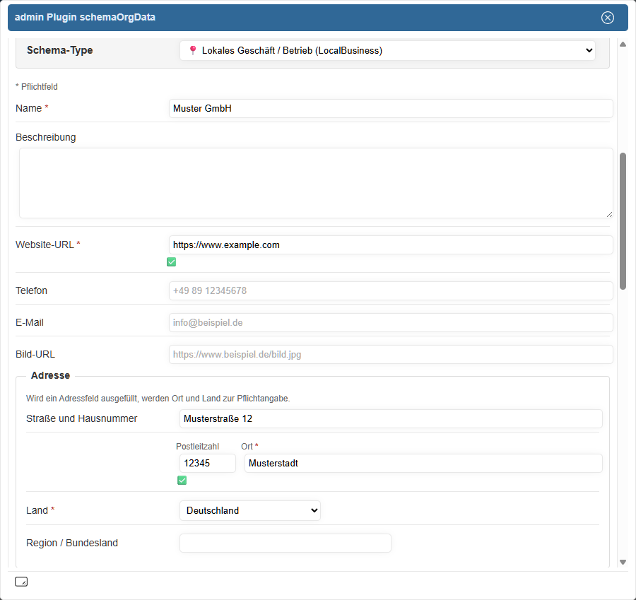

# schemaOrgData — moziloCMS Plugin


[](https://www.gnu.org/licenses/gpl-3.0)

**Strukturierte Daten ohne SEO-Agentur.** `schemaOrgData` schreibt validiertes,
Schema.org-konformes **JSON-LD** in den `<head>` jeder moziloCMS-Seite — für
Unternehmen, Praxen, Kanzleien und Vereine ebenso wie für Seiten mit besonderen
Inhalten (Veranstaltungen, Stellenanzeigen, Spendenaufrufe, FAQ). Das erhöht die
Chance auf **Rich Results** in der Google-Suche. Die komplette Pflege erfolgt
**konfigurationsgetrieben über Formulare im Admin-Bereich**: keine
Code-Kenntnisse nötig, kein Eingriff in Templates (bis auf einen einmalig zu
setzenden Platzhalter), client- und server-seitige Validierung inklusive. Das
Plugin ergänzt die im moziloCMS-Core vorhandenen Microdata um JSON-LD-Blöcke im
`<head>` (siehe [Abgrenzung](#abgrenzung-core)).

---

## Inhaltsverzeichnis

<details>
<summary>Inhaltsverzeichnis anzeigen</summary>

- [Direkter Einstieg](#direkter-einstieg)
  - [Installation](#installation)
  - [Erste Konfiguration](#erste-konfiguration)
- [Features](#features)
  - [Unterstützte Schema-Types](#unterstuetzte-schema-types)
- [Voraussetzungen und Kompatibilität](#voraussetzungen-und-kompatibilitaet)
  - [Abgrenzung zu bestehenden Core-Implementierungen](#abgrenzung-core)
- [Nutzung im Alltag](#nutzung-im-alltag)
  - [Geltungsbereiche und Vererbung](#geltungsbereiche-und-vererbung)
  - [Personen-Registry](#personen-registry)
  - [JSON-LD-Ausgabe im Detail](#json-ld-ausgabe-im-detail)
  - [Adressschema (PostalAddress)](#adressschema-postaladdress)
  - [Öffnungszeiten](#oeffnungszeiten)
  - [Erweiterungsfeld (erweiterte Properties)](#erweiterungsfeld)
  - [Vorhandenes JSON-LD und Import](#vorhandenes-json-ld-und-import)
- [Use Cases und Beispiele](#use-cases-und-beispiele)
  - [Organisations-Identität und @id-Anker](#organisations-identitaet)
  - [Verknüpfte Inhalte (Widgets)](#verknuepfte-inhalte)
- [Validierung und Best Practices](#validierung-und-best-practices)
  - [Formularvalidierung](#formularvalidierung)
  - [Best Practices: Schema.org-Daten sinnvoll pflegen](#best-practices)
  - [Typische Fehler — so bitte nicht](#typische-fehler)
- [Sicherheit](#sicherheit)
- [Entwicklerdokumentation](#entwicklerdokumentation)
- [Tests](#tests)
- [Changelog](#changelog)

</details>

---

<a id="direkter-einstieg"></a>
## Direkter Einstieg

Voraussetzungen in Kurzform: moziloCMS 3.0.4+, PHP 8.1+ — Details unter
[Voraussetzungen und Kompatibilität](#voraussetzungen-und-kompatibilitaet).

<a id="installation"></a>
### Installation

1. ZIP über die moziloCMS-Admin-Oberfläche der Plugin-Verwaltung hochladen
2. Im moziloCMS-Admin unter **Plugins** aktivieren
3. **Wichtig:** Den Platzhalter `{schemaOrgData}` an passender Stelle im
   `<head>`-Bereich des aktiven Layout-Templates (`template.html`) ergänzen —
   **ohne diesen Platzhalter gibt das Plugin im Frontend keinerlei JSON-LD
   aus**, unabhängig von der Konfiguration. Fehlt der Platzhalter, zeigt der
   Admin-Bereich einen entsprechenden Hinweis an. In `gallerytemplate.html`
   sollte der Platzhalter nicht gesetzt werden (siehe
   [JSON-LD-Ausgabe im Detail](#json-ld-ausgabe-im-detail)).

> ⚠️ **`plugin.conf.php` ist zugleich Metadaten-Datei und alleiniger
> Speicherort der kompletten Live-Konfiguration.** Ein manueller
> FTP-Upload überschreibt eine bestehende Konfiguration vollständig und
> ohne Rückfrage — die Datei bei FTP-Updates gezielt von der Übertragung
> ausnehmen. Ein Update per ZIP-Upload über die Admin-Oberfläche ist
> davon nicht betroffen. Hintergrund:
> [docs/configuration.md](docs/configuration.md#zip-install-vs-ftp-update)

<a id="erste-konfiguration"></a>
### Erste Konfiguration

Nach der Installation ist noch keine Ausgabe konfiguriert — das Plugin gibt so
lange kein JSON-LD aus, bis mindestens ein Geltungsbereich einen Schema-Type
zugewiesen bekommen hat. Der schnellste Weg zur ersten Ausgabe, unter
**Plugins → schemaOrgData**:

1. **Geltungsbereich wählen:** **Global** — diese Ebene wird auf jeder Seite
   ausgegeben (siehe [Geltungsbereiche und Vererbung](#geltungsbereiche-und-vererbung)).
2. **Identität festlegen:** genau einen Identitäts-Type wählen, der zur Website
   passt — **Organization**, **NGO** oder einen **LocalBusiness**-Typ (siehe
   [Organisations-Identität und @id-Anker](#organisations-identitaet) sowie
   [Best Practices](#best-practices)).
3. **Pflichtfelder ausfüllen:** Pflichtfelder sind im Formular markiert, die
   Live-Validierung zeigt Fehler und Warnungen sofort an (siehe
   [Formularvalidierung](#formularvalidierung)).



4. **Speichern und prüfen:** Zur Kontrolle der tatsächlichen Ausgabe den
   <a id="debug-modus"></a>**Debug-Modus** aktivieren (zeigt die erzeugten
   JSON-LD-Blöcke im Frontend als Pop-up) und das Ergebnis mit
   [validator.schema.org](https://validator.schema.org) abgleichen.
5. **Weitere Ebenen bei Bedarf:** Für Kategorien oder einzelne Seiten mit
   eigenem Inhalt (Event, FAQ, Stellenanzeige, Spendenaufruf …) analog auf
   Kategorie- bzw. Seiten-Ebene fortfahren — konkrete Beispiele je Type unter
   [Use Cases und Beispiele](#use-cases-und-beispiele).

Im Frontend erscheint das Ergebnis als `<script>`-Block im `<head>` — an der
Stelle des Platzhalters:

```html
<script type="application/ld+json">
{
  "@context": "https://schema.org",
  "@type": "LocalBusiness",
  "name": "Muster GmbH",
  "url": "https://www.example.com",
  "address": {
    "@type": "PostalAddress",
    "streetAddress": "Musterstraße 12",
    "postalCode": "12345",
    "addressLocality": "Musterstadt",
    "addressCountry": "DE"
  },
  "openingHours": ["Mo-Fr 09:00-18:00", "Sa 10:00-14:00"]
}
</script>
```

---
<a id="features"></a>
## Features

**Architektur**
- JSON-LD-Ausgabe im `<head>` der Seite, nicht im Seiteninhalt
- **14 unterstützte Schema-Types** (LocalBusiness, Organization, Event, JobPosting, FAQPage u. a. — [vollständige Liste](#unterstuetzte-schema-types))
- Drei Geltungsbereiche: **Global**, **Kategorie**, **Seite**, mit feldweiser Vererbung (Global → Kategorie → Seite, siehe [Geltungsbereiche und Vererbung](#geltungsbereiche-und-vererbung))

**Redaktion & Bedienung**
- Vollständig über Admin-Formulare pflegbar — kein Templating-Wissen nötig
- **Personen-Registry**: eigener Admin-Bereich zur Verwaltung referenzierbarer Personen (Autoren, Ansprechpartner) mit Rollen-Relationen zur Organisation (siehe [Personen-Registry](#personen-registry))
- Öffnungszeiten-Widget (inkl. optionalem zweitem Zeitraum je Wochentag, z. B. für Mittagspausen)
- Generisches `PostalAddress`-Schema nach schema.org (international einsetzbar)
- **Erweiterungsfeld** (JSON-Textarea) für zusätzliche Properties mit Live-Validierung
- **Erkennung vorhandener JSON-LD-Blöcke** im Layout-Template und im Seiteninhalt, wahlweise Beibehalten oder Überschreiben — plus **Import-Button je erkanntem Block** zur direkten Übernahme ins Formular
- **Debug-Modus**: erzeugte JSON-LD-Blöcke im Frontend als Pop-up anzeigen (zum Abgleich mit validator.schema.org, siehe [Erste Konfiguration](#erste-konfiguration))
- Mehrsprachige Admin-Oberfläche und Frontend-Ausgabe (initial Deutsch und Englisch)

**Datenqualität**
- Validierung via **[AJV.js](https://ajv.js.org/)** (lokal ausgeliefert, kein CDN) client-seitig, plus eigenständige server-seitige Validierung beim Speichern (unabhängig von JavaScript)
- Umfangreiche automatisierte PHPUnit-Test-Suite (siehe [docs/tests.md](docs/tests.md))

**Für Entwickler**
- **Schema-getriebenes Formular**: JSON-Schema-Dateien definieren sowohl Validierungsregeln als auch Formularfelder — kein hardcodiertes PHP für die meisten Types (siehe [Entwicklerdokumentation](#entwicklerdokumentation))
- **@id-Anker und Knotenreferenzen**: Seiten-Typen (z. B. **DonateAction**, **Event**) verweisen per `@id` auf global definierte Identitätsknoten bzw. Registry-Personen — inkl. Schutzmechanismen gegen doppelte und hängende Referenzen (siehe [Organisations-Identität und @id-Anker](#organisations-identitaet))

<a id="unterstuetzte-schema-types"></a>
### Unterstützte Schema-Types

<details>
<summary>Tabelle: alle unterstützten Schema-Types anzeigen</summary>

| Type | Beschreibung | Geltungsbereich |
|---|---|---|
| `LocalBusiness` | Lokales Unternehmen | Global / Kategorie |
| `ProfessionalService` | Dienstleister | Global / Kategorie |
| `LegalService` | Anwaltskanzlei / Rechtsberatung (LocalBusiness-Subtyp) | Global / Kategorie |
| `MedicalBusiness` | Arztpraxis / medizinische Einrichtung (LocalBusiness-Subtyp) | Global / Kategorie |
| `AccountingService` | Steuerberatung / Buchhaltung | Global / Kategorie |
| `Organization` | Organisation / Firma, mit `@id`-Anker `#organization` | Global |
| `NGO` | Gemeinnützige Organisation (Verein, Stiftung u. a.), mit `@id`-Anker `#organization` | Global |
| `WebSite` | Website-Metadaten | Global |
| `FAQPage` | Häufig gestellte Fragen ([Google-Richtlinien beachten](https://developers.google.com/search/docs/appearance/structured-data/faqpage)) | Kategorie / Seite |
| `Article` | Artikel / Blogbeitrag (Autor wahlweise als Referenz oder Direkteingabe) | Kategorie / Seite |
| `JobPosting` | Stellenanzeige | Seite |
| `DonateAction` | Spendenaufruf (verknüpft per `@id` mit dem globalen Org-Knoten) | Seite |
| `Event` | Veranstaltung / Termin | Seite |
| `ProfilePage` | Profilseite (Über-mich-/Autorenseite; Hauptinhalt ist eine Registry-Person) | Seite |

</details>

Details und Konfigurationsbeispiele zu einzelnen Types stehen unter
[Use Cases und Beispiele](#use-cases-und-beispiele). Welche Zusatzfelder
Google für Rich Results je Type zusätzlich zur schema.org-Spec verlangt,
zeigt die [Google Search Gallery](https://developers.google.com/search/docs/appearance/structured-data/search-gallery).

---

<a id="voraussetzungen"></a>
<a id="kompatibilitaet"></a>
<a id="voraussetzungen-und-kompatibilitaet"></a>
## Voraussetzungen und Kompatibilität

- moziloCMS 3.0.4 oder höher
- PHP 8.1+
- Schreibzugriff auf den Plugin-Ordner (für `plugin.conf.php`, siehe [Installation](#installation))
- Empfohlen: `.htaccess`-Weiterleitung auf genau eine Host-Variante, damit die
  `@id`-Anker stabil bleiben (siehe [Basis-URL](docs/use-cases/organization-identity.md#basis-url))
- Kein weiteres Plugin erforderlich
- AJV.js wird lokal ausgeliefert (kein externes CDN)
- Kompatibel mit `seo_urls`-Plugin (optional): kanonische URLs aus
  `seo_urls` können manuell als `url`-Property eingetragen werden

> 📄 Vertiefung (inkl. Abhängigkeiten): [docs/compatibility.md](docs/compatibility.md)

<a id="abgrenzung-core"></a>
### Abgrenzung zu bestehenden Core-Implementierungen

moziloCMS 3.0 enthält bereits Schema.org-Implementierungen als Microdata
(u. a. **Article**-Wrapper, **ImageObject**, **BreadcrumbList**, **LocalBusiness**
im Body). Dieses Plugin **ersetzt** diese Core-Microdata nicht, sondern
**ergänzt** sie um JSON-LD im `<head>`, das von Google und anderen
Suchmaschinen für Rich Results bevorzugt ausgewertet wird.

> 📄 Vertiefung (Tabelle im Detail): [docs/compatibility.md](docs/compatibility.md#abgrenzung-core)

---

<a id="nutzung-im-alltag"></a>
## Nutzung im Alltag

<a id="geltungsbereiche-und-vererbung"></a>
### Geltungsbereiche und Vererbung

Das Plugin kennt drei Konfigurationsebenen:

```
Global      → wird auf jeder Seite ausgegeben
Kategorie   → wird zusätzlich auf allen Seiten der Kategorie ausgegeben
Seite       → wird zusätzlich nur auf dieser einzelnen Seite ausgegeben
```

Beim Seitenaufbau werden alle zutreffenden Ebenen geladen und
zusammengeführt — die spezifischere Ebene überschreibt die allgemeinere,
und zwar feldweise: leere Felder der spezifischeren Ebene übernehmen den
Wert der übergeordneten Ebene, gefüllte Felder überschreiben ihn.
Verschachtelte Felder (z. B. `address`, `openingHours`) werden dabei nicht
innerhalb des Objekts gemergt — hier gewinnt die Ebene mit dem gefüllten
Objekt vollständig.

**Ausschlussliste.** Im Admin-Bereich kann der Nutzer Kategorien definieren,
auf denen die globale Ausgabe **nicht** erfolgt — z. B. Impressum,
Datenschutz, Sitemap. Eine eigenständige Konfiguration der Kategorie oder
ihrer Seiten ist davon nicht betroffen.

> 📄 Vertiefung (Type-Kollision im Detail, Settings-API, `plugin.conf.php`): [docs/configuration.md](docs/configuration.md)

<a id="personen-registry"></a>
### Personen-Registry

Neben den drei Geltungsbereichen gibt es einen vierten, eigenständigen
Admin-Bereich: die **Personen-Registry**. Hier werden Personen (z. B.
Mitarbeitende, Kanzlei-/Praxis-Inhaber, Vereinsvorstand) unabhängig von
Global/Kategorie/Seite zentral gepflegt — Name, Kurzkennung (Slug), Titel,
Position, Beschreibung, Profil-URL, Profil-Links (`sameAs`), Themengebiete
(optional, mehrzeilig), Bild, Sortierung und Status (aktiv/inaktiv).

Registrierte Personen sind an mehreren Stellen im Plugin referenzierbar,
ohne die Daten dort erneut einzugeben:

- als **Autor** eines Artikels (neben Organisation-Referenz und
  Gast-Autor als Direkteingabe),
- als **Ansprechpartner/Veranstalter** eines Events,
- als **Rolle** (Gründer/in, Mitarbeiter/in, Mitglied) in den
  **Organisations-Relationen** der globalen Identität.

Nur aktive Personen stehen in diesen Auswahllisten zur Verfügung —
bestehende Referenzen (z. B. ein bereits veröffentlichter Artikel) bleiben
davon unberührt, siehe [Organisations-Identität und @id-Anker](#organisations-identitaet).

Neben der manuellen Anlage können Registry-Einträge auch aus einem bereits
vorhandenen Personen-Eintrag im Erweiterungsfeld der globalen
Organisations-Identität übernommen werden, siehe
[Erweiterungsfeld (erweiterte Properties)](#erweiterungsfeld).

> 📄 Vertiefung (Feldliste, `@id`-Konvention, Status-Semantik im Detail): [docs/use-cases/organization-identity.md](docs/use-cases/organization-identity.md)

<a id="json-ld-ausgabe-im-detail"></a>
### JSON-LD-Ausgabe im Detail

Das Plugin gibt das JSON-LD ([json-ld.org](https://json-ld.org/)) als
`<script>`-Tag im `<head>` aus — an der Stelle, an der im Layout-Template
der Platzhalter `{schemaOrgData}` steht (Ausgabe-Beispiel siehe
[Erste Konfiguration](#erste-konfiguration)).

Pro Geltungsbereich wird ein eigener `<script>`-Block ausgegeben (Global +
Kategorie + Seite = bis zu drei Blöcke). Leere Felder werden vor der
Ausgabe entfernt; vollständig leere Knoten werden gar nicht ausgegeben.

> 📄 Vertiefung (De-Dup-Verhalten (Duplikat-Vermeidung), weitere
> Ausgabe-Beispiele): [docs/rendering.md](docs/rendering.md); zum
> gallerytemplate-Sonderfall: [docs/import.md](docs/import.md)

<a id="adressschema-postaladdress"></a>
### Adressschema (PostalAddress)

Das Adressfeld folgt exakt `schema.org/PostalAddress` und ist international
ausgelegt: Straße, Postleitzahl, Ort, Region und Land — nur **Ort** und
**Land** sind Pflicht. Das Feld **Land** wird als Select-Box mit Klarnamen
dargestellt (z. B. „Deutschland"), intern wird der
**ISO-3166-1-alpha-2-Code** gespeichert (z. B. `DE`, Standard-Vorauswahl:
Deutschland). Die Länderliste ist in der zugehörigen JSON-Schema-Datei als
`enum` definiert und dort pflegbar.

> 📄 Vertiefung (Formularfelder im Detail): [docs/rendering.md](docs/rendering.md)

<a id="oeffnungszeiten"></a>
### Öffnungszeiten

Das Öffnungszeiten-Widget bildet die sieben Wochentage als Zeitraum-Felder
ab (Von / Bis, plus optionalem zweiten Zeitraum je Tag, z. B. für eine
Mittagspause). Leere Felder werden als „geschlossen" interpretiert. Intern
werden die Werte als `openingHours`-Array nach schema.org-Notation
gespeichert (Beispiel siehe [Erste Konfiguration](#erste-konfiguration)). Es wird ausschließlich das
**24-Stunden-Format** (`HH:MM`) unterstützt.

> 📄 Vertiefung (Regeln für den zweiten Zeitraum): [docs/rendering.md](docs/rendering.md)

<a id="erweiterungsfeld"></a>
### Erweiterungsfeld (erweiterte Properties)

Jede Konfiguration enthält optional ein JSON-Textarea-Feld für
Properties, die das Formular nicht abbildet. Die Inhalte werden beim
Speichern mit den Formularfeldern zusammengeführt (merge). Properties, die
das Formular führt, gehören nicht ins Erweiterungsfeld: Ein gleichnamiger
Schlüssel wird beim Speichern verworfen und gemeldet, damit die
Feldbereinigung des Formulars nicht umgangen werden kann. Die Eingabe wird
zweistufig
validiert — client-seitig live per AJV.js, server-seitig in PHP beim
Speichern.

Enthält das Erweiterungsfeld eines global konfigurierten
Organisations-Types (siehe [Organisations-Identität und @id-Anker](#organisations-identitaet))
eine der Properties `employee`, `founder` oder `member` als einzelnes
Objekt vom Typ `Person`, bietet das Plugin eine Übernahme in die
[Personen-Registry](#personen-registry) an — als Verlinkung mit einer
vorhandenen Person oder als Neuanlage samt Organisations-Relation.

> 📄 Vertiefung (Validierungsstufen und Property-Whitelist / Übernahme-Mechanik): [docs/validation.md](docs/validation.md#erweiterungsfeld-json-textarea) · [docs/use-cases/organization-identity.md](docs/use-cases/organization-identity.md)

<a id="vorhandenes-json-ld-und-import"></a>
### Vorhandenes JSON-LD und Import

Erkennt das Plugin beim Öffnen der Plugin-Verwaltung ein bereits vorhandenes
`<script type="application/ld+json">`, wird dem Benutzer im Admin-Bereich ein
Hinweis angezeigt. Geprüft werden zwei Quellen: das Layout-Template und der
Inhalt jeder einzelnen Seite. Ein Block im Layout gilt layoutweit und wird
deshalb dem Global-Scope zugeordnet, ein Block im Seiteninhalt der jeweiligen
Seite. Für Kategorien gibt es keine eigene Quelle und deshalb keinen eigenen
Hinweis. Der Nutzer wählt dann, ob das Plugin diesen Block **beibehält**
(kein eigenes JSON-LD) oder ihn per eigener Konfiguration **überschreibt** —
ein automatischer Merge findet nicht statt.

Für jeden erkannten Block zeigt das Plugin eine eigene Vorschau samt
**Import-Button** — ein Klick übernimmt genau diesen Block direkt ins
Formular (bekannte Properties in die passenden Felder, unbekannte ins
Erweiterungsfeld). Sind mehrere Blöcke gleichzeitig vorhanden, steht pro
Block ein eigener Button zur Verfügung.

> 📄 Vertiefung (Kollisionserkennung, Import-Parsing im Detail, empfohlene Migrations-Reihenfolge): [docs/import.md](docs/import.md)

---

<a id="use-cases-und-beispiele"></a>
## Use Cases und Beispiele

Zwei Konzepte ziehen sich durch mehrere Types — die globale
Organisations-Identität samt `@id`-Verknüpfung und die beiden Widgets für
Verweise auf solche Knoten. Im Anschluss folgen kompakte Links zu den
ausführlichen Konfigurationsbeispielen je Type.

<a id="organisations-identitaet"></a>
### Organisations-Identität und @id-Anker

Ausgewählte Schema-Types (**Organization**, **NGO**, die **LocalBusiness**-Familie)
erhalten zusätzlich eine stabile `@id` — eine URI, die den Knoten
im Datengraphen eindeutig identifiziert. Seiten-Types wie **DonateAction**
oder **Event** können darüber per `@id` auf den global definierten
Organisations-Knoten verweisen, ohne ihn auf jeder Seite zu wiederholen.
Registrierte Personen (siehe [Personen-Registry](#personen-registry))
erhalten bei tatsächlicher Referenzierung (Artikel-Autor,
`Event.organizer`, Organisations-Relationen) auf dieselbe Weise ein
eigenes `@id`-Fragment je Person. Welcher Type welches `@id`-Fragment
bekommt, wird ausschließlich im jeweiligen JSON-Schema deklariert
(`ui:idFragment`) — es gibt keine Type-Namen im PHP-Code. Ein De-Dup-Guard
sorgt dafür, dass pro Fragment (`#organization`, `#person-{slug}`)
maximal ein Knoten pro Seite die `@id` trägt (sind z. B. **NGO** und
**Organization** gleichzeitig global konfiguriert, bleibt der zweite
Knoten ohne Anker); die absolute Basis-URL wird zur Ausgabezeit aus dem
aktuellen Request abgeleitet.

> 📄 Ausführliches Beispiel (JSON-LD-Beispiel, De-Dup-Guard, Personen-Registry, Basis-URL-Empfehlung): [docs/use-cases/organization-identity.md](docs/use-cases/organization-identity.md)

<a id="verknuepfte-inhalte"></a>
### Verknüpfte Inhalte (Widgets)

Für Verweise auf global definierte Knoten stehen zwei Formular-Widgets zur
Verfügung: **`id_reference`** verweist zwingend auf einen festen Zielknoten,
**`id_reference_or_literal`** lässt den Nutzer wählen zwischen Referenz auf
einen globalen Knoten (Organisation oder Registry-Person) oder
Direkteingabe.

> 📄 Mechanik, Referenz-/Literal-Modus, Schema-Deklaration und Ausgabe-Beispiele: [docs/widgets.md](docs/widgets.md)

### Konfigurationsbeispiele je Type

- [Lokales Unternehmen](docs/use-cases/local-business.md) — `LocalBusiness`-Familie (LocalBusiness, ProfessionalService, LegalService, MedicalBusiness, AccountingService)
- [Event](docs/use-cases/event.md)
- [FAQPage](docs/use-cases/faq.md)
- [JobPosting](docs/use-cases/job-posting.md)
- [DonateAction](docs/use-cases/donate-action.md)
- [Profilseite](docs/use-cases/profilseite.md)

---

<a id="validierung-und-best-practices"></a>
## Validierung und Best Practices

<a id="formularvalidierung"></a>
### Formularvalidierung

Alle Formularfelder werden zweistufig validiert: **live im Browser**
(JavaScript/[AJV](https://ajv.js.org/)) und **server-seitig in PHP** beim Speichern — diese Prüfung
greift eigenständig auch ohne JavaScript. Das Feedback ist dreistufig: ✅
grün (OK) · ⚠️ gelb (Warnung) · ❌ rot (Fehler).

> 📄 Vertiefung (Validierungsregeln je Feld, Regex-Details, E.164-Normalisierung, ISO-8601-Umwandlung der Datumsfelder): [docs/validation.md](docs/validation.md)

<a id="best-practices"></a>
### Best Practices: Schema.org-Daten sinnvoll pflegen

Das Plugin validiert die **Struktur** der eingegebenen Daten — ob die
Daten **inhaltlich** zur Seite passen, liegt in der Verantwortung des
Betreibers:

> **Strukturierte Daten müssen dem sichtbaren Seiteninhalt entsprechen.**
> Suchmaschinen werten Markup, das Inhalte behauptet, die auf der Seite
> nicht sichtbar sind, als irreführend — im schlimmsten Fall führt das zum
> Ausschluss der gesamten Website von Rich Results.

Kurz gefasst: so wenig Types wie nötig, global nur genau eine
Organisations-Identität, Seiten-Types nur dort, wo der Inhalt es hergibt,
und nach jeder Änderung mit [validator.schema.org](https://validator.schema.org)
gegenprüfen.

<a id="typische-fehler"></a>
Typische Fehler — so bitte nicht:

- ❌ `FAQPage` ohne wortgleich sichtbare Fragen/Antworten auf der Seite
- ❌ Mehrere Organisations-Identitäten (**Organization**, **NGO**, **LocalBusiness**) gleichzeitig global konfigurieren
- ❌ Felder befüllen, „weil sie da sind" — geschätzte/erfundene Werte schaden mehr als leere Felder

> 📄 Vertiefung (vollständige Empfehlungsliste inkl. Begründungen, Google-Richtlinien, schema.org-Vokabular): [docs/best-practices.md](docs/best-practices.md)

---

<a id="sicherheit"></a>
## Sicherheit

Mehrere Härtungsmechanismen greifen ineinander: ein `IS_CMS`-Guard gegen
Direktaufruf jeder PHP-Datei, Settings-Key-Härtung gegen Path-Traversal,
serverseitiges Eingabe-Sanitizing, `JSON_HEX_TAG`-Schutz gegen
Script-Breakout in der JSON-LD-Ausgabe, eine maßgebliche server-seitige
Validierung (unabhängig von JavaScript) sowie lokal ausgeliefertes AJV.js
ohne CDN-Abhängigkeit.

> 📄 Vertiefung: [docs/security.md](docs/security.md)

---

<a id="entwicklerdokumentation"></a>
## Entwicklerdokumentation

Das Plugin ist in eine schlanke Fassaden-Klasse (`index.php`) und
eigenständige Komponenten unter `lib/` aufgeteilt — jede Komponente mit
eigenem `IS_CMS`-Guard, per `require_once` geladen. Neue Schema-Types
kommen ausschließlich als `.json`-Datei in `schemas/` hinzu (Validierung
und Formularfelder in einer Datei), ohne PHP-Änderung.

Die vertiefende Dokumentation (`docs/`, dieser Ordner) liegt als Geschwister
von `plugins/` am Repo-Root, analog zu `tests/` — sie ist nicht Teil des
Deployment-Pakets.

Die Konfigurationsdaten werden **nicht** als Dateien im Plugin-Ordner
abgelegt, sondern über die moziloCMS-eigene Settings-API (`$this->settings`)
unter ebenenspezifischen Schlüsseln gespeichert und landen physisch in
`plugin.conf.php` (siehe [Installation](#installation) für den
FTP-Hinweis). Die Personen-Registry nutzt denselben Mechanismus über einen
eigenen, von den drei Geltungsebenen unabhängigen Settings-Schlüssel.

Weiterführende Entwicklerdokumentation:

- [docs/architecture.md](docs/architecture.md) — Komponentenaufbau und Zusammenspiel der `lib/`-Klassen
- [docs/schema-extending.md](docs/schema-extending.md) — neuen Schema-Type per JSON-Datei hinzufügen, Sprachschlüssel-Konvention
- [docs/schema/](docs/schema/) — Referenz der schema-getriebenen `ui:`-Properties
- [docs/rendering.md](docs/rendering.md) — Formular-Rendering und JSON-LD-Erzeugung im Detail
- [docs/widgets.md](docs/widgets.md) — `id_reference` / `id_reference_or_literal`: Mechanik und Schema-Deklaration
- [docs/import.md](docs/import.md) — Import-Feature im Detail
- [docs/configuration.md](docs/configuration.md) — Settings-API, Geltungsbereiche und Speicherformat
- [docs/tests.md](docs/tests.md) — lokales Setup, Commit-Konventionen, Testausführung

---

<a id="tests"></a>
## Tests

Das Plugin verwendet **PHPUnit 11.x** für Unit-Tests. Da moziloCMS kein
eigenes Test-Framework mitbringt, werden CMS-Abhängigkeiten (Konstanten,
Basisklassen) im Test-Bootstrap gemockt.

```bash
composer install
./vendor/bin/phpunit
```

Das Plugin ist umfassend automatisiert getestet (PHPUnit + Jest) und
wird ergänzend per Browser-Regressionstests (Playwright) gegen eine
reale moziloCMS-Installation verifiziert.

> `vendor/` ist in `.gitignore`; die Tests liegen im
> Entwicklungs-Repository eine Ebene über dem Plugin-Ordner und sind
> nicht Teil des Deployment-Pakets.

> 📄 Vertiefung: [docs/tests.md](docs/tests.md)

---

<a id="changelog"></a>
## Changelog

Eine kuratierte Übersicht der nennenswerten Änderungen steht in
[CHANGELOG.md](CHANGELOG.md).
