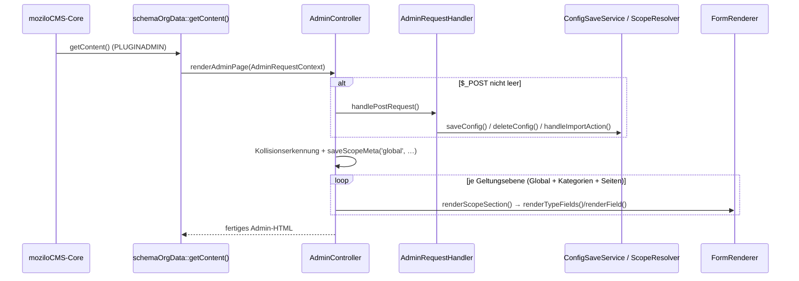
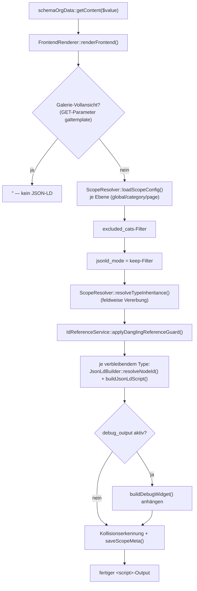

# Architektur

Das Plugin ist in eine schlanke Fassaden-Klasse (`index.php`, Klasse
`schemaOrgData extends Plugin`) und zustandslose Komponenten unter `lib/`
aufgeteilt. Jede `lib/`-Datei trägt einen eigenen `IS_CMS`-Guard
(`<?php if(!defined('IS_CMS')) die();`) und wird per `require_once` aus
`index.php` geladen — es gibt keinen Autoloader.

## Grundprinzip: Fassade + zustandslose Komponenten

`schemaOrgData` selbst hält nur:

- die moziloCMS-Pflichtmethoden (`getContent()`, `getConfig()`, `getInfo()`),
- Sprachzustand (`$admin_lang`, `$weekday_lang`, `$pluginLang`), der über
  mehrere Methodenaufrufe hinweg konsistent bleiben muss, und
- **Lazy-Accessoren** für jede `lib/`-Komponente (z. B. `private function
  formRenderer(): SchemaOrgData_FormRenderer { return
  $this->formRendererInstance ??= new SchemaOrgData_FormRenderer(); }`).

Alle `lib/`-Klassen sind selbst **zustandslos**: Kollaboratoren (andere
Komponenten, `Language`-Instanzen, `$this->settings`, `PLUGIN_SELF_DIR`)
werden bei jedem Aufruf als Parameter durchgereicht statt im Konstruktor
eingefroren. Das hält die Klassen unabhängig voneinander testbar (siehe
[tests.md](tests.md), Abschnitt „Warum ein eigenes Test-Bootstrap nötig
ist") und macht Abhängigkeiten an der
Methodensignatur sichtbar. Zwei Ausnahmen bestätigen das Prinzip:

- `SchemaOrgData_SchemaRepository` cacht `loadSchema()`- und
  `getAvailableSchemaTypes()`-Ergebnisse **pro Instanz** (Dateisystemzugriffe
  vermeiden), nicht global.
- Die beiden Context-Objekte (siehe unten) sind selbst unveränderlich
  (`readonly`-Properties), bündeln aber nur bereits woanders gehaltenen
  Zustand.

## Die beiden Einstiegspunkte

`schemaOrgData::getContent(mixed $value): string` ist der einzige von
moziloCMS aufgerufene Einstiegspunkt und verzweigt anhand der Konstante
`PLUGINADMIN`:

```
getContent($value)
├─ PLUGINADMIN definiert (Admin-Iframe-Dialog)
│    → SchemaOrgData_AdminController::renderAdminPage(SchemaOrgData_AdminRequestContext)
└─ sonst (Frontend, Platzhalter {schemaOrgData} im Template)
     → SchemaOrgData_FrontendRenderer::renderFrontend($value, SchemaOrgData_FrontendRequestContext)
```

Beide Zweige bauen zuerst ein **Context-Objekt** (`final class` mit
ausschließlich `readonly`-Properties), das alle für den jeweiligen Zweig
nötigen Kollaboratoren bündelt:

- `SchemaOrgData_FrontendRequestContext` — 8 Properties: `settings`,
  `pluginSelfDir`, `scopeResolver`, `schemaRepository`, `jsonLdBuilder`,
  `idReferenceService`, `collisionDetector`, `urlHelper`.
- `SchemaOrgData_AdminRequestContext` — 19 Properties: zusätzlich zu den
  Frontend-Kollaboratoren u. a. `lang`, `formRenderer`, `dataSplitHelper`,
  `pluginLang`, `pluginSelfUrl`, `weekdayLang`, `validator`,
  `openingHoursHelper`, `adminPageRenderer`, `adminRequestHandler`,
  `configSaveService`, `importService`.

Der Seiteninhalt (`$value`) ist bewusst **kein** Teil von
`SchemaOrgData_FrontendRequestContext` — er ist Methoden-Input für die
Kollisionserkennung, kein Laufzeit-Kontext, und bleibt eigener Parameter
von `renderFrontend()`.

## Komponentenübersicht (`lib/`)

| Komponente | Verantwortung |
|---|---|
| `SchemaOrgData_UrlHelper` | Leitet die absolute Basis-URL der Installation aus dem Request ab (`resolveBaseUrl()`, gespiegelt an der Core-Logik der kanonischen URL), plus eine um ein `ADMIN_DIR_NAME`-Segment gekürzte Variante für Admin-Anzeigen (`resolveFrontendBaseUrl()`). |
| `SchemaOrgData_LanguageService` | Ordnet einen CMS-Sprachcode (`de`, `deDE`, …) dem Plugin-internen Locale (`deDE`/`enEN`) zu und instanziiert die passenden `Language`-Objekte aus `sprachen/`. |
| `SchemaOrgData_SchemaRepository` | Lädt und cacht JSON-Schema-Dateien aus `schemas/` (`loadSchema()`), löst `$ref`-Verweise auf Definitionsblöcke auf (`resolveSchemaRef()`), listet verfügbare Types (`getAvailableSchemaTypes()`) und ermittelt den aktiven Type einer Scope-Konfiguration (`resolveActiveType()`, für die LocalBusiness-Familienprüfung). |
| `SchemaOrgData_ScopeResolver` | Kapselt die gesamte Geltungsbereichs-Logik: Settings-Key-Bildung (`getScopeSettingsKey()`), Bezeichner-Sanitizing (`sanitizeScopeIdentifier()`), Ermittlung der aktiven Kategorie/Seite (`resolveScopeIdentifiers()`), Laden/Speichern von Konfiguration und Meta-Daten (`loadScopeConfig()`, `loadScopeMeta()`, `saveScopeMeta()`, `deleteConfig()`), feldweise Vererbung (`mergeConfigs()`, `resolveTypeInheritance()`) und Type-Kollisionserkennung (`detectTypeCollision()`). Siehe [configuration.md](configuration.md). |
| `SchemaOrgData_JsonLdBuilder` | Baut aus zusammengeführten Formulardaten den fertigen `<script type="application/ld+json">`-Block: HTML-Entity-Dekodierung, Leerfeld-Bereinigung, verschachtelte `PostalAddress`/`GeoCoordinates`/`Place`-Typisierung, `id_reference`/`id_reference_or_literal`-Auflösung, `@id`-Vergabe (`resolveNodeId()`, De-Dup-Guard). Siehe [rendering.md](rendering.md). |
| `SchemaOrgData_IdReferenceService` | Ergänzt den `@id`-Mechanismus um zwei Dienste: verfügbare globale `@id`-Fragmente für das `id_reference_or_literal`-Dropdown (`resolveAvailableGlobalFragments()`) sowie den Dangling-Reference-Guard (`applyDanglingReferenceGuard()`), der hängende Verweise auf fehlende Zielknoten abfängt. Siehe [rendering.md](rendering.md). |
| `SchemaOrgData_CollisionDetector` | Erkennt vorhandene `<script type="application/ld+json">`-Blöcke in Template und Seiteninhalt, sowohl frontend- (`extractExistingJsonLdBlocksFromTemplate()`) als auch admin-seitig (`extractExistingJsonLdBlocksFromTemplateAdmin()`, inkl. Draftmode), und prüft, ob der Plugin-Platzhalter im Template steht und innerhalb `<head>` liegt (`detectPluginPlaceholderInTemplateAdmin()`). Siehe [import.md](import.md). |
| `SchemaOrgData_OpeningHoursHelper` | Reine Array-/String-Transformationen für das Öffnungszeiten-Widget: Erkennung roher Pro-Tag-Werte (`isPerDayOpeningHoursValue()`), Parsen eines `openingHours`-Arrays in Von/Bis-Zeiten je Wochentag (`parseOpeningHours()`) und die Umkehrung (`buildOpeningHoursArray()`). |
| `SchemaOrgData_DataSplitHelper` | Trennt gespeicherte bzw. importierte Properties eines Types anhand des aktiven Schemas in bekannte Formularfelder und unbekannte Erweiterungs-Properties (`splitDataForRendering()`) — gemeinsamer Mapper für `FormRenderer` und `ImportService`. |
| `SchemaOrgData_Validator` | Serverseitige Feldvalidierung (PLZ, Telefon, URL, E-Mail, Öffnungszeiten, ISO-/deutsches Datum, Geo-Koordinaten, PostalAddress, FAQ) sowie die formularweite Validierung `validateFormData()`, die pro Widget-Typ delegiert. |
| `SchemaOrgData_FormRenderer` | Rendert das schema-getriebene Admin-Formular: Widget-Rendering je `ui:widget` (`renderField()`), zusammengesetzte Widgets (`postal_address`, `opening_hours`, `faq_list`, `geo`, `place`, `id_reference`, `id_reference_or_literal`), Validierungs-Feedback und Badges. Siehe [rendering.md](rendering.md). |
| `SchemaOrgData_ImportService` | Parst einen eingefügten JSON-LD-Block (`importJsonLd()`) und trennt ihn per `DataSplitHelper` in Formular-/Erweiterungsfeld-Daten. Siehe [import.md](import.md). |
| `SchemaOrgData_ConfigSaveService` | Save-Flow-Pipeline des Admin-Formulars: vererbungsbewusste Feldauflösung für Placeholder/Badge (`resolveInheritableFields()`), POST-Bereinigung (`sanitizePostData()`, `sanitizeAddressData()`), Erweiterungsfeld-Validierung (`validateExtensionField()`) und die eigentliche Validieren-und-Speichern-Orchestrierung (`saveConfig()`). Siehe [configuration.md](configuration.md). |
| `SchemaOrgData_ValidationResult` | Unveränderliches Ergebnis-Objekt (`success`, `errors`, `extensionData`) der Validierungsphase in `ConfigSaveService::validateExtensionField()`. |
| `SchemaOrgData_AdminController` | Orchestriert eine einzelne Geltungsbereich-Sektion (`renderScopeSection()`) sowie die vollständige Admin-Seite (`renderAdminPage()`): POST-Verarbeitung anstoßen, alle Scopes vorrendern, Assets samt Cache-Busting einbinden. |
| `SchemaOrgData_AdminPageRenderer` | Zustandslose, reine Anzeige-Bausteine der Admin-Seite: Admin-CSS (`getAdminCss()`), Info-Block, Scope-Label/-Selektor, Speichern-Button-Beschriftung, Speicher-Ergebnis-Hinweis, Hinweis auf vorhandenes/kollidierendes JSON-LD samt Import-UI (`renderExistingJsonLdNotice()`), Ausschlussliste, Platzhalter-Hinweis, Type-Auswahl. |
| `SchemaOrgData_AdminRequestHandler` | POST/Actions-Dispatch: verteilt `$_POST['schemaOrgData']` je Geltungsebene auf `deleteConfig()` oder `ConfigSaveService::saveConfig()`, bzw. auf den Import-Pfad (`handleImportAction()`), wenn der Import-Button ausgelöst wurde. |
| `SchemaOrgData_FrontendRenderer` | Orchestriert die Frontend-Ausgabepipeline: Scope-Konfiguration laden, `excluded_cats`- und `jsonld_mode = 'keep'`-Filter, feldweise Vererbung, Dangling-Reference-Guard, JSON-LD-Blöcke ausgeben, optional Debug-Widget (`buildDebugWidget()`) anhängen, scope-genaue Kollisionserkennung persistieren. |
| `SchemaOrgData_FrontendRequestContext` / `SchemaOrgData_AdminRequestContext` | Reine Daten-Objekte, bündeln die Laufzeit-Kollaboratoren für `renderFrontend()` bzw. `renderAdminPage()`/`renderScopeSection()`. |

## Kontrollfluss: Admin-Request

<details>
<summary>Diagramm: Kontrollfluss Admin-Request (POST-Dispatch, Speichern, Formular-Rendering)</summary>



</details>

Grobe Flughöhe des obigen Diagramms: Fassade → Scope-Auflösung /
POST-Dispatch → Speichern (Validierung inklusive) → Formular-Rendering.
Der folgende ASCII-Aufrufbaum bleibt die maßgebliche Detailquelle
(exakte Methodennamen und Verzweigungslogik):

```
schemaOrgData::getContent()
  └─ SchemaOrgData_AdminController::renderAdminPage(AdminRequestContext)
       ├─ falls $_POST nicht leer:
       │    SchemaOrgData_AdminRequestHandler::handlePostRequest()
       │      ├─ Import-Button gesetzt?  → handleImportAction()
       │      │     → SchemaOrgData_ImportService::importJsonLd()
       │      │     → schreibt Ergebnis zurück nach $_POST['schemaOrgData'][scope]
       │      └─ sonst je Geltungsebene (global/category/page):
       │            SchemaOrgData_ScopeResolver::deleteConfig()
       │            oder
       │            SchemaOrgData_ConfigSaveService::saveConfig()
       │              ├─ resolveInheritableFields()
       │              ├─ SchemaOrgData_Validator::validateFormData()
       │              ├─ validateExtensionField() → SchemaOrgData_ValidationResult
       │              ├─ sanitizePostData() / sanitizeAddressData()
       │              └─ $settings->set(scopeKey, $config)
       ├─ SchemaOrgData_CollisionDetector::extractExistingJsonLdBlocksFromTemplateAdmin()
       │     → SchemaOrgData_ScopeResolver::saveScopeMeta('global', …)
       └─ je Geltungsebene (Global + alle Kategorien + alle Seiten, vorgerendert):
            SchemaOrgData_AdminController::renderScopeSection()
              ├─ SchemaOrgData_AdminPageRenderer::renderInfoBlock() / renderExistingJsonLdNotice() / …
              ├─ SchemaOrgData_IdReferenceService::resolveAvailableGlobalFragments()
              └─ je verfügbarem Type:
                   SchemaOrgData_FormRenderer::renderTypeFields()
                     └─ renderField() je Property (siehe rendering.md)
```

Nur die aktive Sektion ist sichtbar und ihre Felder sind nicht `disabled`;
`initScopeSelector()` (`js/validator.js`) schaltet beim Scope-Wechsel
Sichtbarkeit und `disabled`-Status clientseitig um, ohne die Seite neu zu
laden (moziloCMS öffnet die Plugin-Einstellungen über einen JS-Tab, ein
Page-Reload würde diesen schließen). Alle Sektionen werden dennoch serverseitig
vorgerendert — inaktive per Regex (`preg_replace('/<(input|select|textarea)(\s)/i',
…)`) nachträglich mit `disabled="disabled"` versehen, damit beim Speichern nur
die aktive Sektion übertragen wird.

## Kontrollfluss: Frontend-Request

<details>
<summary>Diagramm: Kontrollfluss Frontend-Request (Scope-Auflösung, JSON-LD-Aufbau, Ausgabe)</summary>



</details>

Grobe Flughöhe: Fassade → Scope-Auflösung/Filter → JSON-LD-Aufbau →
Ausgabe. Der folgende ASCII-Aufrufbaum bleibt die maßgebliche
Detailquelle (exakte Methodennamen und Verzweigungslogik):

```
schemaOrgData::getContent($value)
  └─ SchemaOrgData_FrontendRenderer::renderFrontend($value, FrontendRequestContext)
       ├─ Galerie-Vollansicht (GET-Parameter "galtemplate")? → '' (kein JSON-LD)
       ├─ CAT_REQUEST/PAGE_REQUEST sanitizen (Lese-/Schreibpfad-Symmetrie)
       ├─ SchemaOrgData_ScopeResolver::loadScopeConfig() je Ebene (global/category/page)
       ├─ excluded_cats-Filter → globale Ebene ggf. verwerfen
       ├─ jsonld_mode = 'keep'-Filter je Ebene → Ebene ggf. verwerfen ($globalSuppressedByKeep)
       ├─ SchemaOrgData_ScopeResolver::resolveTypeInheritance() (feldweise Vererbung)
       ├─ SchemaOrgData_IdReferenceService::applyDanglingReferenceGuard()
       ├─ je verbleibendem Type:
       │    SchemaOrgData_JsonLdBuilder::resolveNodeId()   (@id-Vergabe, De-Dup-Guard)
       │    SchemaOrgData_JsonLdBuilder::buildJsonLdScript() (<script>-Block)
       ├─ debug_output aktiv? → buildDebugWidget() anhängen
       └─ SchemaOrgData_CollisionDetector::extractExistingJsonLdBlocksFromTemplate() / …Blocks($value)
            → SchemaOrgData_ScopeResolver::saveScopeMeta() (nur bei Änderung, scope-genau)
```

Details zu den einzelnen Guards (`excluded_cats`, `jsonld_mode`, De-Dup-,
Dangling-Reference-Guard) stehen in [rendering.md](rendering.md) und
[configuration.md](configuration.md); das Import-/Kollisions-Zusammenspiel
in [import.md](import.md).

## Siehe auch

- [../README.md](../README.md) — Feature-Überblick und Nutzerdokumentation
- [file-structure.md](file-structure.md) — vollständiger Datei- und Ordnerbaum
- [rendering.md](rendering.md) — Formular-Rendering und JSON-LD-Erzeugung im Detail
- [configuration.md](configuration.md) — Settings-API, Geltungsbereiche und Speicherformat
- [import.md](import.md) — Import-Feature im Detail
- [schema-extending.md](schema-extending.md) — neuen Schema-Type per JSON-Datei hinzufügen
- [development.md](development.md) — lokales Setup, Entwicklungskonventionen
