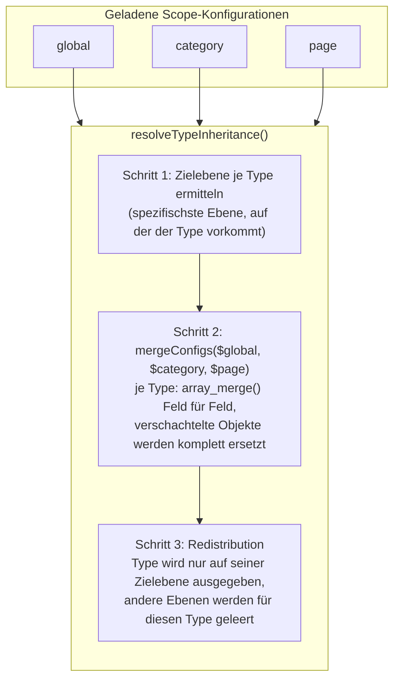

# Konfiguration und Geltungsbereiche

Die gesamte Plugin-Konfiguration läuft über die moziloCMS-eigene
Settings-API (`$this->settings`, eine `Properties`-Instanz des Cores) statt
über eigene Dateien. `SchemaOrgData_ScopeResolver` kapselt vollständig, wie
aus einem Geltungsbereich ein Settings-Key wird und wie mehrere Ebenen zu
einer finalen Konfiguration verschmelzen.

## Die drei Settings-Keys

`SchemaOrgData_ScopeResolver::getScopeSettingsKey(string $scope, ?string
$cat, ?string $page): ?string` bildet je Geltungsebene einen eigenen
Schlüssel:

```
'global'                       → 'config_global'
'category', $cat = 'kontakt'   → 'config_cat_kontakt'
'page', $cat='kontakt', $page='impressum' → 'config_page_kontakt_impressum'
```

Ungültige Kombinationen (z. B. `scope = 'category'` ohne `$cat`) liefern
`null`. Jeder Settings-Key enthält ein assoziatives Array der Form

```php
[
    'TypeName' => ['property' => 'wert', /* … */],
    '_meta' => ['existing_jsonld' => bool, 'jsonld_mode' => 'keep'|'override', 'existing_jsonld_content' => '…', 'existing_jsonld_blocks' => ['…']],
    // nur config_global:
    'excluded_cats' => 'kat1,kat2',
    'debug_output' => bool,
    'org_relations' => [/* … */],
]
```

`TypeName` ist zugleich der Dateiname des Schemas (ohne `.json`) — pro
Settings-Key steht üblicherweise genau ein Type-Schlüssel (das Formular
bietet nur einen Type gleichzeitig zur Auswahl an), technisch ist die
Struktur aber offen für mehrere. `_meta` trägt die Kollisionserkennungs-
Metadaten (siehe [import.md](import.md)) und wird von `saveConfig()`
sowie `saveScopeMeta()`/`loadScopeMeta()` unabhängig von den
Type-Properties gepflegt.

## Kategorie-/Seiten-Bezeichner ermitteln

`resolveScopeIdentifiers(string $scope): array{0: ?string, 1: ?string}`
liefert `[cat, page]` für einen Scope. Im **Frontend** stammen die Werte
aus den moziloCMS-Konstanten `CAT_REQUEST`/`PAGE_REQUEST`. Im
**Admin-Kontext** (Plugin-Iframe) sind diese Konstanten nicht gesetzt —
dort fällt die Methode auf Plugin-eigene Parameter zurück, in der
Reihenfolge **POST vor GET** (`schemaOrgData_cat`/`schemaOrgData_page`):
POST hat Vorrang, weil das Speichern-Formular ohne Query-String an
`admin/index.php` sendet.

Jeder Bezeichner läuft vor Verwendung durch
`sanitizeScopeIdentifier(string $value): string` —
`preg_replace('/[^a-zA-Z0-9_\-%]/', '', $value)`. Erlaubt bleiben
Buchstaben, Ziffern, Bindestrich, Unterstrich sowie `%` (moziloCMS
URL-kodiert Bezeichner mit Sonderzeichen); Path-Traversal-Zeichen
(`.`, `/`, `\`, NUL) werden entfernt.

Das schützt vor Path-Traversal in Settings-Keys und hält zugleich Lese-
und Schreib-Key für dieselbe Kategorie/Seite zusammen: **Jeder Pfad, der
einen Settings-Key bildet, sanitiert** — der Frontend-Lesepfad
(`renderFrontend()`), der Speicherpfad (`renderAdminPage()`/`saveConfig()`),
der Import (`handleImportAction()`) und die Sektionsanzeige im Admin
(`renderScopeSection()`). Das ist nicht redundant, sondern notwendig:
`mo_rawurlencode()` lässt den Punkt unkodiert, ein Bezeichner wie
`Dr.%20Meier` erreicht die Schlüsselbildung also mit Punkt, und
`sanitizeScopeIdentifier()` entfernt ihn. Sanitierte nur ein Teil der
Pfade, entstünden für eine solche Kategorie zwei verschiedene Schlüssel.
Die **rohen** Bezeichner bleiben dort in Gebrauch, wo nicht der Schlüssel,
sondern der Name gemeint ist: in der Anzeige (`buildScopeLabel()`), in den
`data-scope-*`-Attributen und beim Lesen des Seiteninhalts über den Kern
(`get_PageContent()`), der seine eigene Schlüsselform erwartet.

## Physischer Speicherort: `plugin.conf.php`

`$this->settings` wird nicht vom Plugin selbst instanziiert, sondern vom
moziloCMS-Core im `Plugin`-Basiskonstruktor: `new
Properties(BASE_DIR.PLUGIN_DIR_NAME."/".$plugin_class_dir."/plugin.conf.php")`.
Intern hält `Properties` ein einziges assoziatives PHP-Array, in dem
`config_global`, `config_cat_*` und `config_page_*_*` gleichrangige
Top-Level-Schlüssel sind — die gesamte Konfiguration aller drei
Geltungsebenen liegt also in **einer** Datei. Die Datei wird mit
vorangestelltem `<?php die(); ?>`-Schutzheader (verhindert Direktaufruf
im Browser) und `serialize()` geschrieben (`file_put_contents(...,
LOCK_EX)`).

**Nur im `IS_ADMIN`-Kontext wird tatsächlich persistiert.** Im reinen
Frontend-Kontext ist `Properties::set()` ein No-Op auf Dateiebene — ein
`set()`-Aufruf dort wirkt nur virtuell für die laufende Anfrage, ohne die
Datei zu verändern. Das Plugin nutzt im Frontend deshalb keinen
Schreibpfad: `SchemaOrgData_FrontendRenderer::renderFrontend()` wertet die
Kollisionserkennung von Layout-Template und Seiteninhalt live aus, statt sie
zu speichern.
Geschrieben wird sie ausschließlich beim Aufbau der
Plugin-Verwaltungsseite (`SchemaOrgData_AdminController::renderAdminPage()`,
mit Schreib-Guard gegen unnötige Schreibvorgänge).

### ZIP-Install vs. FTP-Update

Der Core-Installer (`PclZip_PreExtractCallBack()` in
`admin/plugins.php`) überspringt `plugin.conf.php` beim Entpacken eines
Plugin-Updates über die Admin-Oberfläche, falls die Datei auf dem Ziel
bereits existiert — ein reguläres Update über **ZIP-Upload** lässt die
Live-Konfiguration also unangetastet. Diese Schutzlogik hängt
ausschließlich am ZIP-Install-Pfad: Ein manueller **FTP-Upload**
überschreibt `plugin.conf.php` byteweise ohne PHP-Beteiligung und wird
von ihr nicht erfasst — enthält die hochgeladene Datei eine andere (z. B.
leere) Konfiguration, überschreibt sie die Live-Konfiguration auf dem
Zielsystem vollständig, ohne Rückfrage. Wer per FTP aktualisiert, sollte
`plugin.conf.php` deshalb gezielt von der Übertragung ausnehmen. Fehlt die
Datei komplett, erzeugt der Core beim nächsten Aufruf der
Plugin-Verwaltungsseite automatisch eine neue mit leerem Array.

## Feldweise Vererbung

<details>
<summary>Diagramm: Ablauf von resolveTypeInheritance() über mergeConfigs()</summary>



</details>

### `mergeConfigs()`

`mergeConfigs(array ...$configs): array` führt beliebig viele
Ebenen-Konfigurationen (jeweils `['TypeName' => [...], ...]`) zusammen:
spätere Arrays überschreiben gleichnamige Properties früherer Arrays,
mit `array_merge()` je Type. Aufgerufen als `mergeConfigs($global,
$category, $page)` — die Aufrufreihenfolge codiert die
Rangfolge Global → Kategorie → Seite.

### `resolveTypeInheritance()`

`resolveTypeInheritance(array $scopeConfigs): array` (Eingabe/Ausgabe:
`['global' => [...], 'category' => [...], 'page' => [...]]`) ist der
eigentliche Vererbungsalgorithmus, aufgerufen in
`SchemaOrgData_FrontendRenderer::renderFrontend()` nach den
`excluded_cats`-/`jsonld_mode`-Filtern:

1. **Zielebene je Type ermitteln** — für jeden Type wird gemerkt, auf
   welcher Ebene er zuletzt in der Iteration `['global', 'category',
   'page']` vorkommt (`$typeScopes[$type] = $scope`) — das ist stets die
   **spezifischste** Ebene, auf der dieser Type überhaupt konfiguriert
   ist.
2. **Felder zusammenführen** — `mergeConfigs($global, $category, $page)`
   liefert je Type ein einziges, feldweise vererbtes Array: leere/fehlende
   Felder der spezifischeren Ebene übernehmen den Wert der übergeordneten
   Ebene, gefüllte Felder überschreiben ihn. Bei verschachtelten Feldern
   (`address`, `openingHours`, `geo`, …) gewinnt die Ebene mit dem
   gefüllten Objekt **vollständig** — es gibt kein Merge innerhalb eines
   verschachtelten Objekts, `array_merge()` ersetzt den gesamten
   Unterbaum.
3. **Redistribution** — jeder zusammengeführte Type wird in
   `$scopeConfigs` an genau der Stelle eingetragen, die
   `$typeScopes[$type]` aus Schritt 1 vorgibt; alle anderen Ebenen werden
   für diesen Type geleert. Die Ausgabeschleife in `renderFrontend()`
   gibt dadurch jeden Type **einmalig** auf seiner spezifischsten Ebene
   aus.

Verschiedene Types bleiben dabei vollständig unabhängig voneinander —
z. B. kann `LocalBusiness` auf Global und `Event` auf einer Seite
koexistieren, ohne dass Vererbungslogik zwischen ihnen greift.

**Beispiel:** `LocalBusiness` global mit `name = "Beispiel GmbH"` und
`telephone = "+49 89 123456"`; dieselbe Konfiguration auf Kategorie
`kontakt` nur mit `name = "Beispiel GmbH – Filiale Nord"`. Ergebnis auf
Seiten der Kategorie `kontakt`: `name = "Beispiel GmbH – Filiale Nord"`
(überschrieben), `telephone = "+49 89 123456"` (von global geerbt),
ausgegeben einmalig auf Kategorie-Ebene — die globale Ebene gibt
`LocalBusiness` für diese Kategorie nicht zusätzlich aus.

### Admin-Anzeige der Vererbung

`SchemaOrgData_ConfigSaveService::resolveInheritableFields()` (rein für
die Formularanzeige, siehe [rendering.md](rendering.md)) und
`SchemaOrgData_ScopeResolver::detectTypeCollision()` (Hinweistext
„Type X wird von Ebene Y geerbt", `SchemaOrgData_AdminPageRenderer::
renderCollisionNotice()`) bilden denselben Vererbungsgedanken für die
Formularoberfläche nach, ohne selbst zu mergen — sie beantworten nur
„welche allgemeinere Ebene hat für diesen Type/dieses Feld bereits einen
Wert gesetzt".

## Ausschlussliste (`excluded_cats`, nur global)

Komma-separierte Liste sanitierter Kategorie-Bezeichner, gespeichert unter
`config_global.excluded_cats`. `SchemaOrgData_FrontendRenderer::
renderFrontend()` prüft vor jeder anderen Verarbeitung, ob die aktuelle
`CAT_REQUEST` in dieser Liste steht — falls ja, wird die globale Ebene
komplett aus `$scopeConfigs` entfernt, bevor `resolveTypeInheritance()`
läuft. Eine eigenständige Kategorie- oder Seiten-Konfiguration bleibt
davon unberührt.

## LocalBusiness-Familie (`ui:family`)

Types mit demselben `ui:family`-Wert (aktuell **LocalBusiness**,
**ProfessionalService**, **LegalService**, **MedicalBusiness**,
**AccountingService** — alle `"localBusiness"`) gelten als gegenseitig
exklusiv unterhalb von Global: Ist auf Global bereits ein Familienmitglied
konfiguriert, filtert `SchemaOrgData_AdminController::
renderScopeSection()` die übrigen Mitglieder aus dem
Kategorie-Type-Dropdown, und `SchemaOrgData_ConfigSaveService::
saveConfig()` weist eine dennoch übermittelte Auswahl serverseitig mit
`error_family_type_mismatch` zurück (Schutz gegen Formular-Manipulation).
Details zur Deklaration in [schema-extending.md](schema-extending.md).

## Siehe auch

- [../README.md](../README.md) — Nutzersicht auf Geltungsbereiche, Vererbung, Ausschlussliste
- [architecture.md](architecture.md) — Rolle von `SchemaOrgData_ScopeResolver` im Gesamtsystem
- [rendering.md](rendering.md) — wie die zusammengeführte Konfiguration zu JSON-LD wird
- [import.md](import.md) — `_meta`/`existing_jsonld`/`jsonld_mode` im Detail
