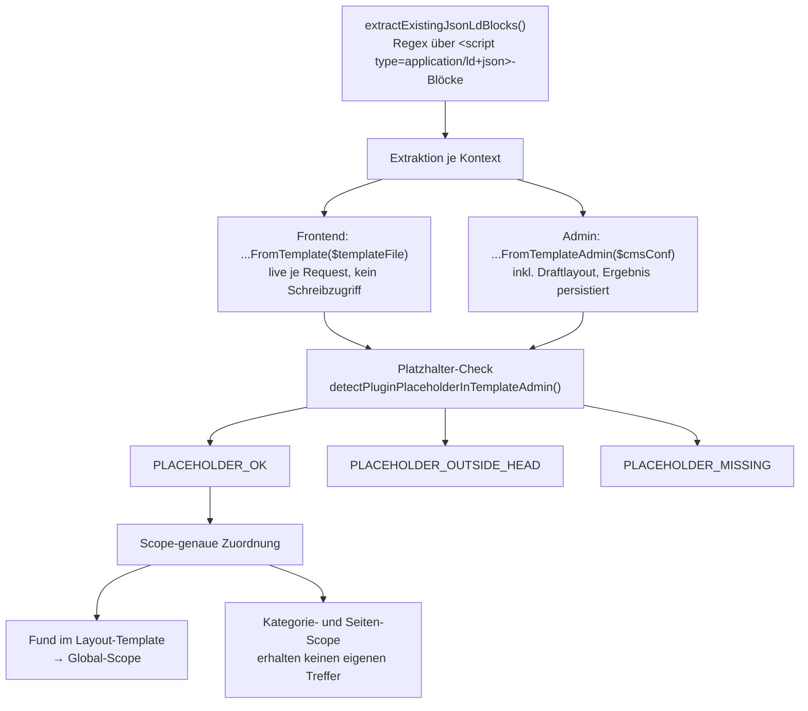
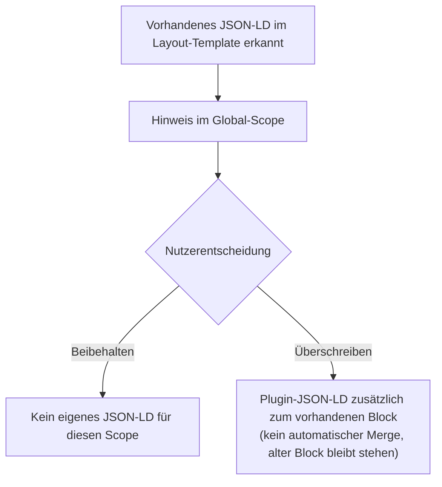

# Import-Feature

Das Import-Feature besteht aus zwei zusammenspielenden, aber unabhängigen
Teilen: **Kollisionserkennung** (`SchemaOrgData_CollisionDetector` findet
vorhandenes JSON-LD im Layout-Template) und **Import-Parsing**
(`SchemaOrgData_ImportService` übernimmt einen erkannten JSON-LD-Block ins
Formular). Die Admin-UI dafür rendert
`SchemaOrgData_AdminPageRenderer::renderExistingJsonLdNotice()`, die
POST-Verarbeitung übernimmt `SchemaOrgData_AdminRequestHandler::
handleImportAction()`.

## Kollisionserkennung (`SchemaOrgData_CollisionDetector`)

Diagramm: Kollisionserkennung — Extraktion, Platzhalter-Check, Scope-Zuordnung

Grundlage aller Erkennungsmethoden ist ein Regex über
`<script type="application/ld+json">`-Blöcke im Layout-Template — im
Frontend live je Request, im Admin zusätzlich über das Draftlayout.
Beide Kontexte prüfen ausschließlich `template.html` — ein JSON-LD-Block,
der nur in `gallerytemplate.html` steht, zählt nicht mit. Grund: Eine
Galerie-Vollansicht rendert strukturell nie echten Seiteninhalt (eigenes
Voll-Layout ohne `{CONTENT}`-Platzhalter), ein dort gefundener Block wäre
für die reale Seiten-/Kategorie-Ausgabe irrelevant und würde sonst
fälschlich mit dem realen Block aus `template.html` konkateniert (siehe
auch [../README.md](../README.md), Abschnitt „Galerie-Vollansichten").

### Platzhalter-Check

Zusätzlich wird geprüft, ob der Plugin-Platzhalter (`{schemaOrgData}` bzw.
`{schemaOrgData|param}`) überhaupt im aktiven Template steht und ob er vor
oder nach `</head>` liegt:

| Konstante | Bedeutung |
|---|---|
| `PLACEHOLDER_OK` | Platzhalter gefunden innerhalb `<head>` — oder die Prüfung war mangels Grundlage (fehlende Konstanten, kein `$cmsConf`, leeres Layout) nicht durchführbar (Fail-safe, kein Fehlalarm auf Basis unklarer Umgebung) |
| `PLACEHOLDER_OUTSIDE_HEAD` | Platzhalter gefunden, aber hinter `</head>` |
| `PLACEHOLDER_MISSING` | Platzhalter nicht gefunden |

Bei `PLACEHOLDER_MISSING` zeigt der Admin-Bereich eine harte
Fehlermeldung (ohne Platzhalter ruft der Core `getContent()` im Frontend
nirgends auf — das Plugin bleibt wirkungslos, unabhängig von der
Konfiguration), bei `PLACEHOLDER_OUTSIDE_HEAD` einen zurückhaltenden
Info-Hinweis (funktioniert in der Praxis meist trotzdem, da Browser den
Inhalt faktisch in den `<body>` durchreichen).

### Scope-genaue Zuordnung

Ein im **Layout-Template** gefundener Block ist layoutweit gültig und
wird ausschließlich dem **Global-Scope** zugeordnet. Der **Seiteninhalt**
wird nicht geprüft; **Kategorie- und Seiten-Scope** erhalten über diesen
Mechanismus deshalb keinen eigenen Treffer. Ein dort aus früheren Beständen
gespeichertes `existing_jsonld`-Flag bleibt wirksam und über die
`keep`/`override`-Auswahl bedienbar.

Das Ergebnis (`existing_jsonld`-Flag plus die Liste gefundener Blöcke,
`existing_jsonld_blocks`) wird ausschließlich im Admin-Pfad über
`SchemaOrgData_ScopeResolver::saveScopeMeta()` unter `config_global`
persistiert. Der Frontend-Pfad speichert nichts: `Properties::set()` ist
außerhalb von `IS_ADMIN` ein No-Op (siehe
[configuration.md](configuration.md)), weshalb `renderFrontend()` den
Layout-Zustand bei jedem Request live liest und unmittelbar auswertet. Für
Meta-Daten aus einer Version vor dem serverseitigen Pro-Block-Import
(Einzelstring `existing_jsonld_content` statt Blockliste) normalisiert
`loadScopeMeta()` beim Lesen automatisch auf das neue Array-Format. Ein
Schreib-Guard verhindert unnötige Schreibvorgänge: `saveScopeMeta()` wird
nur aufgerufen, wenn sich Flag, Inhalt oder Blockliste seit dem letzten
Laden geändert haben — sonst würde jeder Admin-Seitenaufruf ein
`file_put_contents()` auf `plugin.conf.php` auslösen.

### `keep`/`override` und die Wirkung auf die eigene Ausgabe

Diagramm: Entscheidungsablauf bei erkanntem JSON-LD (Beibehalten vs. Überschreiben)

Ist `existing_jsonld = true` für einen Scope, zeigt
`renderExistingJsonLdNotice()` eine Radio-Auswahl:

- **`keep`** (Default, solange keine Wahl getroffen wurde) — das Plugin
  gibt für diesen Scope **kein eigenes** JSON-LD aus. Betrifft die
  globale Ebene, wirkt sich `keep` zusätzlich auf den
  Dangling-Reference-Guard aus (siehe [rendering.md](rendering.md)): eine
  `id_reference` auf den globalen Knoten wird dann unterdrückt statt
  einen Stub zu erzwingen, weil `keep` als ausdrücklicher Nutzerwunsch
  Vorrang hat.
- **`override`** — das Plugin gibt sein eigenes JSON-LD **zusätzlich**
  zum vorhandenen Block aus. Es erfolgt **kein automatischer Merge** —
  der vorhandene Block bleibt im Template/Inhalt stehen und muss manuell
  entfernt werden.

Der gewählte Modus wird pro Scope gespeichert und ist jederzeit änderbar.

## Import-Parsing (`SchemaOrgData_ImportService`)

`importJsonLd()` ist bewusst einfach gehalten: JSON dekodieren (bei
Syntaxfehler `success = false`), `@type` extrahieren, die restlichen
Properties per `SchemaOrgData_DataSplitHelper::splitDataForRendering()`
in bekannte Formularfelder und unbekannte Erweiterungs-Properties trennen
— derselbe Mapper, der auch beim regulären Formular-Rendering die
gespeicherte Konfiguration aufteilt (siehe [rendering.md](rendering.md)).
Der serverseitige Import-Umbau (siehe unten) hat an diesem Service nichts
geändert — er bleibt byte-identisch und bekommt weiterhin genau einen
Rohtext-Block pro Aufruf übergeben.

Es erfolgt **kein Merge** mit der aktuellen Formularkonfiguration — der
Aufrufer ersetzt die Konfiguration dieser Ebene vollständig mit dem
Ergebnis.

## Admin-UI: Pro-Block-Import

`renderExistingJsonLdNotice()` rendert unterhalb der `keep`/`override`-Wahl
für **jeden** erkannten Block (`existing_jsonld_blocks`) eine eigene
Pretty-Print-Vorschau (`<pre>`) mit zugehörigem Vollansicht-Dialog
(`data-dialog`/`data-dialog-close`, verdrahtet über `initPreviewDialogs()`
in `js/validator.js`) sowie einen eigenen Submit-Button
(`schemaOrgData_import_action`, Value `"{scope}"` bzw. `"{scope}:{index}"`
— Index-Default `0`). Bei genau einem erkannten Block erscheint der Button
ohne Blocküberschrift, bei mehreren mit „… 1/2"/„… 2/2" usw. Ein Klick löst
den Import dieses konkreten Blocks unmittelbar aus — es gibt keinen
Zwischenschritt und keinen weiteren Bestätigungsklick.

Es gibt **kein** Import-Textarea und **keinen** manuellen Einfüge-Pfad
mehr: Der frühere zweistufige Ablauf (Autofill-Button überträgt den Block
per Client-Roundtrip in ein Textarea, das dann separat abgeschickt wird,
bzw. alternativ manuelles Einfügen in dasselbe Textarea) ist mit dem
serverseitigen Pro-Block-Import entfallen. `handleImportAction()`
(`SchemaOrgData_AdminRequestHandler`) liest den zu importierenden Rohtext
stattdessen serverseitig direkt aus der persistierten Scope-Meta
(`existing_jsonld_blocks[$index]`) — nicht mehr aus `$_POST`. Ein nicht
vorhandener Index liefert `error_import_block_not_found`, ungültiges
Block-JSON `error_detected_block_invalid`.

`SchemaOrgData_AdminRequestHandler::handlePostRequest()` gibt dem
Import-Dispatch weiterhin Vorrang: Ist der Import-Button gesetzt, wird
ausschließlich der Import verarbeitet — auch wenn das Formular zusätzlich
Felddaten der aktiven Sektion mitsendet, finden in diesem Request kein
`saveConfig()`/`deleteConfig()` statt.

## Empfohlene Migrations-Reihenfolge

1. Gewünschten Block über seinen eigenen Import-Button übernehmen (bei
   mehreren erkannten Blöcken zuvor per Vollansicht-Dialog den richtigen
   identifizieren).
2. Übernommene Formularfelder prüfen und anpassen.
3. Alten JSON-LD-Block manuell aus dem Layout-Template entfernen.
4. Auf `override` umstellen — oder den Hinweis ignorieren: Ist der alte
   Block aus dem Layout entfernt, greift `keep` nicht mehr, weil das
   Frontend den Layout-Zustand bei jedem Request neu liest. Der
   Admin-Hinweis verschwindet beim nächsten Öffnen der Plugin-Verwaltung.

## Siehe auch

- [../README.md](../README.md) — Nutzersicht: „Vorhandenes JSON-LD und Import"
- [rendering.md](rendering.md) — `SchemaOrgData_DataSplitHelper`, Dangling-Reference-Guard und `keep`-Interaktion
- [configuration.md](configuration.md) — `_meta`/`existing_jsonld`/`jsonld_mode` im Speicherformat
- [architecture.md](architecture.md) — Einordnung von `CollisionDetector`/`ImportService` im Gesamtsystem
