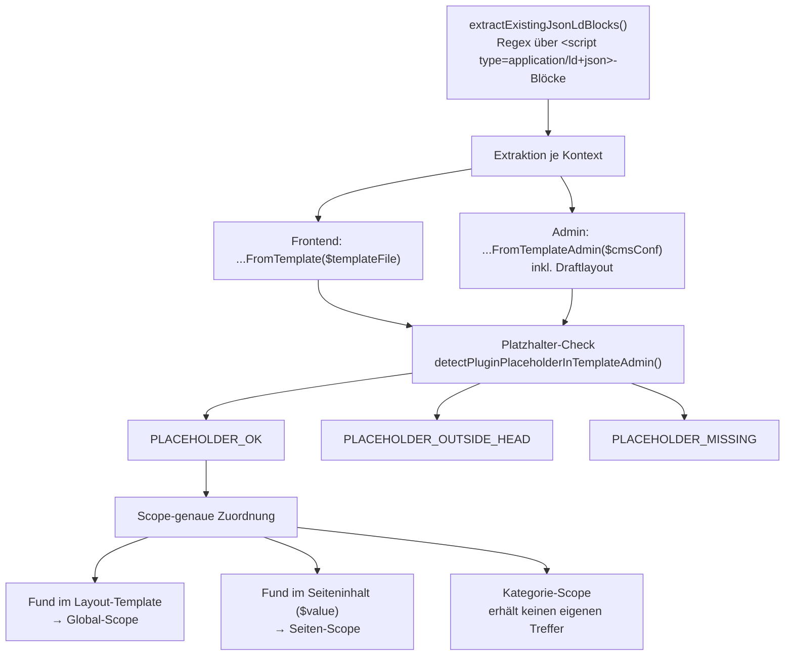
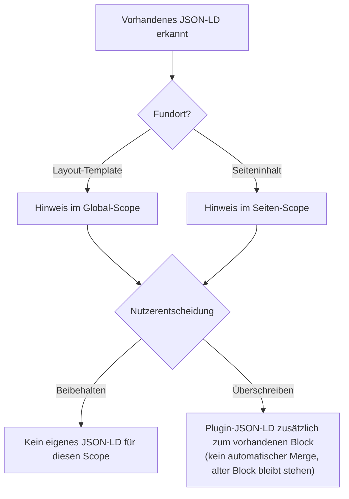

# Import-Feature

Das Import-Feature besteht aus zwei zusammenspielenden, aber unabhängigen
Teilen: **Kollisionserkennung** (`SchemaOrgData_CollisionDetector` findet
vorhandenes JSON-LD in Template/Seiteninhalt) und **Import-Parsing**
(`SchemaOrgData_ImportService` übernimmt einen vom Nutzer eingefügten
JSON-LD-Block ins Formular). Die Admin-UI dafür rendert
`SchemaOrgData_AdminPageRenderer::renderExistingJsonLdNotice()`, die
POST-Verarbeitung übernimmt `SchemaOrgData_AdminRequestHandler::
handleImportAction()`.

## Kollisionserkennung (`SchemaOrgData_CollisionDetector`)

Diagramm: Kollisionserkennung — Extraktion, Platzhalter-Check, Scope-Zuordnung

Grundlage aller Erkennungsmethoden ist ein Regex über
`<script type="application/ld+json">`-Blöcke, sowohl im Layout-Template
(Frontend- wie Admin-Pfad, inkl. Draftlayout) als auch im Seiteninhalt.
Beide Kontexte prüfen ausschließlich `template.html` — ein JSON-LD-Block,
der nur in `gallerytemplate.html` steht, zählt nicht mit. Grund: Eine
Galerie-Vollansicht rendert strukturell nie echten Seiteninhalt (eigenes
Voll-Layout ohne `{CONTENT}`-Platzhalter), ein dort gefundener Block wäre
für die reale Seiten-/Kategorie-Ausgabe irrelevant und würde sonst
fälschlich mit dem realen Block aus `template.html` konkateniert (siehe
auch [../README.md](../README.md), Abschnitt „Galerie-Vollansichten").

### Platzhalter-Check

Zusätzlich wird geprüft, ob der Plugin-Platzhalter (`{schemaOrgData}` bzw.
`{schemaOrgData|param}`) überhaupt im aktiven Template steht und ob er vor
oder nach `</head>` liegt:

| Konstante | Bedeutung |
|---|---|
| `PLACEHOLDER_OK` | Platzhalter gefunden innerhalb `<head>` — oder die Prüfung war mangels Grundlage (fehlende Konstanten, kein `$cmsConf`, leeres Layout) nicht durchführbar (Fail-safe, kein Fehlalarm auf Basis unklarer Umgebung) |
| `PLACEHOLDER_OUTSIDE_HEAD` | Platzhalter gefunden, aber hinter `</head>` |
| `PLACEHOLDER_MISSING` | Platzhalter nicht gefunden |

Bei `PLACEHOLDER_MISSING` zeigt der Admin-Bereich eine harte
Fehlermeldung (ohne Platzhalter ruft der Core `getContent()` im Frontend
nirgends auf — das Plugin bleibt wirkungslos, unabhängig von der
Konfiguration), bei `PLACEHOLDER_OUTSIDE_HEAD` einen zurückhaltenden
Info-Hinweis (funktioniert in der Praxis meist trotzdem, da Browser den
Inhalt faktisch in den `<body>` durchreichen).

### Scope-genaue Zuordnung

Ein im **Layout-Template** gefundener Block ist layoutweit gültig und
wird ausschließlich dem **Global-Scope** zugeordnet. Ein im
**Seiteninhalt** gefundener Block ist seitenspezifisch und wird
ausschließlich dem **Seiten-Scope** der betreffenden Seite zugeordnet (nur
wenn `CAT_REQUEST`/`PAGE_REQUEST` gesetzt sind). Der **Kategorie-Scope**
erhält über diesen Mechanismus grundsätzlich keinen eigenen Treffer —
beide Quellen (Template, Seiteninhalt) haben kein kategoriespezifisches
Signal.

Das Ergebnis (`existing_jsonld`-Flag plus gefundener Inhalt) wird pro
Scope über `SchemaOrgData_ScopeResolver::saveScopeMeta()` persistiert,
identisch für Frontend- und Admin-Pfad. Ein Schreib-Guard verhindert dabei
unnötige Schreibvorgänge: `saveScopeMeta()` wird nur aufgerufen, wenn sich
Flag oder Inhalt seit dem letzten Laden geändert haben — sonst würde jeder
Admin-Seitenaufruf bzw. jeder Frontend-Request einen `file_put_contents()`
auf `plugin.conf.php` auslösen.

### `keep`/`override` und die Wirkung auf die eigene Ausgabe

Diagramm: Entscheidungsablauf bei erkanntem JSON-LD (Beibehalten vs. Überschreiben)

Ist `existing_jsonld = true` für einen Scope, zeigt
`renderExistingJsonLdNotice()` eine Radio-Auswahl:

- **`keep`** (Default, solange keine Wahl getroffen wurde) — das Plugin
  gibt für diesen Scope **kein eigenes** JSON-LD aus. Betrifft die
  globale Ebene, wirkt sich `keep` zusätzlich auf den
  Dangling-Reference-Guard aus (siehe [rendering.md](rendering.md)): eine
  `id_reference` auf den globalen Knoten wird dann unterdrückt statt
  einen Stub zu erzwingen, weil `keep` als ausdrücklicher Nutzerwunsch
  Vorrang hat.
- **`override`** — das Plugin gibt sein eigenes JSON-LD **zusätzlich**
  zum vorhandenen Block aus. Es erfolgt **kein automatischer Merge** —
  der vorhandene Block bleibt im Template/Inhalt stehen und muss manuell
  entfernt werden.

Der gewählte Modus wird pro Scope gespeichert und ist jederzeit änderbar.

## Import-Parsing (`SchemaOrgData_ImportService`)

`importJsonLd()` ist bewusst einfach gehalten: JSON dekodieren (bei
Syntaxfehler `success = false`), `@type` extrahieren, die restlichen
Properties per `SchemaOrgData_DataSplitHelper::splitDataForRendering()`
in bekannte Formularfelder und unbekannte Erweiterungs-Properties trennen
— derselbe Mapper, der auch beim regulären Formular-Rendering die
gespeicherte Konfiguration aufteilt (siehe [rendering.md](rendering.md)).

Es erfolgt **kein Merge** mit der aktuellen Formularkonfiguration — der
Aufrufer ersetzt die Konfiguration dieser Ebene vollständig mit dem
Ergebnis.

## Admin-UI: Autofill vs. manueller Import

`renderExistingJsonLdNotice()` rendert unterhalb der `keep`/`override`-Wahl
einen einklappbaren Import-Bereich: Wurde bereits ein automatisch
befüllbarer Block erkannt, zeigt ein Autofill-Button eine Vorschau und
überträgt den Block per Klick ins Import-Feld, ohne sofort zu speichern.
Sind mehrere `<script>`-Blöcke gleichzeitig erkannt worden (kein gültiges
Einzel-JSON mehr), wird der Autofill-Button zugunsten eines erklärenden
Hinweistexts unterdrückt — der passende Block muss dann manuell aus der
Vorschau kopiert werden. Daneben steht immer ein manueller Pfad (Textarea
plus „Importieren"-Button) zur Verfügung, der sich in diesem Fall
automatisch öffnet.

`SchemaOrgData_AdminRequestHandler::handlePostRequest()` gibt dem
Import-Dispatch Vorrang: Ist der Import-Button gesetzt, wird ausschließlich
der Import verarbeitet — auch wenn das Formular zusätzlich Felddaten der
aktiven Sektion mitsendet, finden in diesem Request kein
`saveConfig()`/`deleteConfig()` statt.

## Empfohlene Migrations-Reihenfolge

1. Vorhandenes JSON-LD in das Import-Feld übernehmen (Autofill-Button
   oder manuell einfügen) und importieren.
2. Übernommene Formularfelder prüfen und anpassen.
3. Alten JSON-LD-Block manuell aus Template bzw. Seiteninhalt entfernen.
4. Auf `override` umstellen (oder, falls der alte Block bereits entfernt
   wurde, bleibt `keep` wirkungslos, da `existing_jsonld` beim nächsten
   Request ohnehin auf `false` fällt).

## Siehe auch

- [../README.md](../README.md) — Nutzersicht: „Vorhandenes JSON-LD und Import"
- [rendering.md](rendering.md) — `SchemaOrgData_DataSplitHelper`, Dangling-Reference-Guard und `keep`-Interaktion
- [configuration.md](configuration.md) — `_meta`/`existing_jsonld`/`jsonld_mode` im Speicherformat
- [architecture.md](architecture.md) — Einordnung von `CollisionDetector`/`ImportService` im Gesamtsystem
