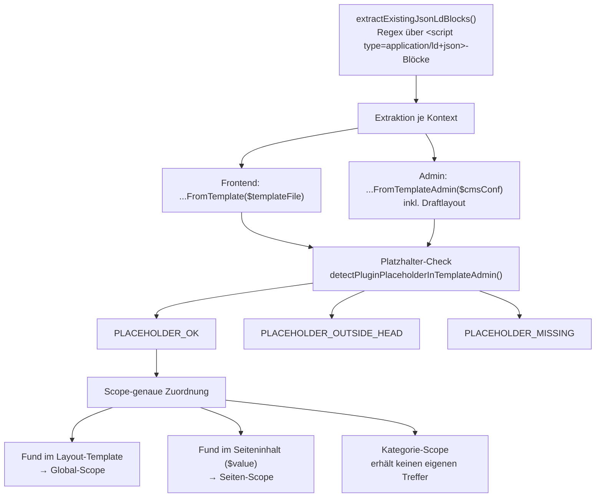

# Import-Feature

Das Import-Feature besteht aus zwei zusammenspielenden, aber unabhängigen
Teilen: **Kollisionserkennung** (`SchemaOrgData_CollisionDetector` findet
vorhandenes JSON-LD in Template/Seiteninhalt) und **Import-Parsing**
(`SchemaOrgData_ImportService` übernimmt einen vom Nutzer eingefügten
JSON-LD-Block ins Formular). Die Admin-UI dafür rendert
`SchemaOrgData_AdminPageRenderer::renderExistingJsonLdNotice()`, die
POST-Verarbeitung übernimmt `SchemaOrgData_AdminRequestHandler::
handleImportAction()`.

## Kollisionserkennung (`SchemaOrgData_CollisionDetector`)

Diagramm: Kollisionserkennung — Extraktion, Platzhalter-Check, Scope-Zuordnung

### Extraktion

`extractExistingJsonLdBlocks(string $html): string[]` ist die gemeinsame
Grundlage aller Erkennungsmethoden: ein einzelner Regex
(`##is`)
extrahiert die inneren JSON-Texte aller gefundenen Blöcke.

Zwei Kontexte nutzen diese Basis:

- **Frontend** — `extractExistingJsonLdBlocksFromTemplate(string
  $templateFile)` liest die aktiv geladene Template-Datei (`$TEMPLATE_FILE`
  aus dem moziloCMS-Frontend-Kontext) direkt vom Dateisystem.
- **Admin** — `extractExistingJsonLdBlocksFromTemplateAdmin($cmsConf)`
  leitet den Template-Pfad aus `$cmsConf->get('cmslayout')` ab
  (`BASE_DIR . LAYOUT_DIR_NAME . '/' . $layout . '/template.html'`). Ist
  Draftmode aktiv (`$cmsConf->get('draftmode') === 'true'`), wird
  zusätzlich das Draftlayout geprüft. Inaktive Layouts werden bewusst
  **nicht** geprüft (Schutz vor False Positives).

Beide Methoden prüfen ausschließlich `template.html` — ein JSON-LD-Block,
der nur in `gallerytemplate.html` steht, zählt nicht mit. Grund: Eine
Galerie-Vollansicht rendert strukturell nie echten Seiteninhalt (eigenes
Voll-Layout ohne `{CONTENT}`-Platzhalter), ein dort gefundener Block wäre
für die reale Seiten-/Kategorie-Ausgabe irrelevant und würde sonst
fälschlich mit dem realen Block aus `template.html` konkateniert (siehe
auch [../README.md](../README.md), Abschnitt „Galerie-Vollansichten").

### Platzhalter-Check

`detectPluginPlaceholderInTemplateAdmin($cmsConf, string $pluginName):
string` prüft zusätzlich, ob der Plugin-Platzhalter (`{schemaOrgData}`
bzw. `{schemaOrgData|param}`) überhaupt im aktiven Template steht und ob
er vor oder nach `</head>` liegt. Rückgabe ist eine von drei Konstanten:

| Konstante | Bedeutung |
|---|---|
| `PLACEHOLDER_OK` | Platzhalter gefunden innerhalb `<head>` — oder die Prüfung war mangels Grundlage (fehlende Konstanten, kein `$cmsConf`, leeres Layout) nicht durchführbar (Fail-safe, kein Fehlalarm auf Basis unklarer Umgebung) |
| `PLACEHOLDER_OUTSIDE_HEAD` | Platzhalter gefunden, aber hinter `</head>` |
| `PLACEHOLDER_MISSING` | Platzhalter nicht gefunden |

`SchemaOrgData_AdminPageRenderer::renderPlaceholderMissingNotice()`
rendert dazu einen scope-unabhängigen Hinweis: eine harte Fehlermeldung
bei `PLACEHOLDER_MISSING` (ohne Platzhalter ruft der Core `getContent()`
im Frontend nirgends auf — das Plugin bleibt wirkungslos, unabhängig von
der Konfiguration), einen zurückhaltenden Info-Hinweis bei
`PLACEHOLDER_OUTSIDE_HEAD` (funktioniert in der Praxis meist trotzdem, da
Browser den Inhalt faktisch in den `<body>` durchreichen).

### Scope-genaue Zuordnung

Ein im **Layout-Template** gefundener Block ist layoutweit gültig und
wird ausschließlich dem **Global-Scope** zugeordnet. Ein im
**Seiteninhalt** (`$value`) gefundener Block ist seitenspezifisch und
wird ausschließlich dem **Seiten-Scope** der betreffenden Seite
zugeordnet (nur wenn `CAT_REQUEST`/`PAGE_REQUEST` gesetzt sind). Der
**Kategorie-Scope** erhält über diesen Mechanismus grundsätzlich keinen
eigenen Treffer — beide Quellen (Template, Seiteninhalt) haben kein
kategoriespezifisches Signal.

`SchemaOrgData_FrontendRenderer::renderFrontend()` und
`SchemaOrgData_AdminController::renderAdminPage()` persistieren das
Ergebnis identisch: `existing_jsonld` (bool) und `existing_jsonld_content`
(die gefundenen Blöcke, mit `implode("\n\n", …)` zusammengefügt) über
`SchemaOrgData_ScopeResolver::saveScopeMeta()`. Ein **Schreib-Guard**
verhindert unnötige Schreibvorgänge: `saveScopeMeta()` wird nur
aufgerufen, wenn sich Flag oder Inhalt seit dem letzten Laden geändert
haben (`loadScopeMeta()` vorher vergleichen) — sonst würde jeder
Admin-Seitenaufruf bzw. jeder Frontend-Request einen
`file_put_contents()` auf `plugin.conf.php` auslösen.

### `keep`/`override` und die Wirkung auf die eigene Ausgabe

Ist `existing_jsonld = true` für einen Scope, zeigt
`renderExistingJsonLdNotice()` eine Radio-Auswahl:

- **`keep`** (Default, solange keine Wahl getroffen wurde) — das Plugin
  gibt für diesen Scope **kein eigenes** JSON-LD aus.
  `SchemaOrgData_FrontendRenderer::renderFrontend()` entfernt die
  betroffene Ebene komplett aus `$scopeConfigs`, bevor
  `resolveTypeInheritance()` läuft. Ist die betroffene Ebene `global`,
  wird zusätzlich `$globalSuppressedByKeep = true` gesetzt — das
  beeinflusst wiederum den Dangling-Reference-Guard (siehe
  [rendering.md](rendering.md)): eine `id_reference` auf den globalen
  Knoten wird dann unterdrückt statt einen Stub zu erzwingen, weil
  `keep` als ausdrücklicher Nutzerwunsch Vorrang hat.
- **`override`** — das Plugin gibt sein eigenes JSON-LD **zusätzlich**
  zum vorhandenen Block aus. Es erfolgt **kein automatischer Merge** —
  der vorhandene Block bleibt im Template/Inhalt stehen und muss manuell
  entfernt werden. `renderExistingJsonLdNotice()` weist auf diese
  Konsequenz explizit hin (`notice_keep_consequence_hint`).

Der gewählte Modus wird pro Scope in `_meta.jsonld_mode` gespeichert
(`SchemaOrgData_ConfigSaveService::saveConfig()`, aus
`$_POST['schemaOrgData_jsonld_mode_<scope>']`) und ist jederzeit
änderbar.

## Import-Parsing (`SchemaOrgData_ImportService`)

`importJsonLd(string $jsonLdText, ?array $schema,
SchemaOrgData_DataSplitHelper $dataSplitHelper): array` ist bewusst
einfach gehalten:

1. `json_decode()` — bei Syntaxfehler oder Nicht-Array-Ergebnis:
   `success = false` mit `json_last_error_msg()`.
2. `@type` extrahieren, `@context`/`@type` aus den Daten entfernen.
3. `SchemaOrgData_DataSplitHelper::splitDataForRendering($data, $schema)`
   trennt die restlichen Properties in bekannte Formularfelder
   (`formData`) und unbekannte Properties (`extensionData`) — derselbe
   Mapper, der auch beim regulären Formular-Rendering die gespeicherte
   Konfiguration aufteilt (siehe [rendering.md](rendering.md)).

Es erfolgt **kein Merge** mit der aktuellen Formularkonfiguration — der
Aufrufer ersetzt die Konfiguration dieser Ebene vollständig mit dem
Ergebnis.

### Henne-Ei-Problem: Schema vor dem Parsen

`importJsonLd()` benötigt das aktive Schema bereits für den
Formular-/Erweiterungsfeld-Split — das Schema hängt aber vom `@type` des
eingefügten JSON-LD ab, der erst nach dem `json_decode()` bekannt ist.
`SchemaOrgData_AdminRequestHandler::handleImportAction()` löst das, indem
es den Rohtext selbst vorab dekodiert, `@type` daraus liest, das
zugehörige Schema lädt und dessen `ui:scopes` gegen den Ziel-Scope
prüft — erst danach wird `SchemaOrgData_ImportService::importJsonLd()`
aufgerufen (der damit unverändert bleibt). Passt der `@type` nicht zu
einem bekannten Schema oder ist der Scope für diesen Type nicht zulässig,
bricht der Import mit `error_invalid_schema_type` ab.

### Rückschreiben ins Formular

Bei Erfolg schreibt `handleImportAction()` das Ergebnis nach
`$_POST['schemaOrgData'][$scope] = ['type' => …, 'data' => …, 'extension'
=> […]]` und löscht den rohen Textarea-Wert
(`$_POST['schemaOrgData_import_<scope>']`). Damit übernimmt der
bestehende Re-Display-Pfad (`SchemaOrgData_AdminController::
renderScopeSection()`, dieselbe Logik wie nach einem fehlgeschlagenen
Speichern) das importierte Formular, ohne einen eigenen
Rendering-Mechanismus zu benötigen — `renderScopeSection()` erkennt
`$usePostData` unabhängig davon, ob die Ursache ein fehlgeschlagenes
Speichern oder ein (erfolgreicher oder fehlgeschlagener) Import war.

Ein Sonderfall betrifft `openingHours`: `importJsonLd()` liefert das Feld
unverändert in der komprimierten schema.org-Notation (z. B. `["Mo-Th
08:00-12:00", …]`), wie sie im importierten JSON-LD steht. Der
POST-Re-Display-Pfad erwartet dort aber die Pro-Tag-Formularstruktur
(dieser Pfad wurde ursprünglich nur für das Re-Display nach
fehlgeschlagenem Speichern gebaut, wo `sanitizePostData()` erst nach
erfolgreicher Validierung komprimiert). `handleImportAction()` konvertiert
einen noch komprimierten Wert deshalb vor dem Zurückschreiben über
`SchemaOrgData_OpeningHoursHelper::parseOpeningHours()` (dieselbe Methode,
die auch beim regulären Rendering aus gespeicherter Konfiguration
verwendet wird) in die Pro-Tag-Struktur.

## Admin-UI: Ein-Klick- vs. manueller Import-Pfad

`renderExistingJsonLdNotice()` rendert unterhalb der `keep`/`override`-Wahl
einen einklappbaren Import-Bereich:

- **Ein-Klick-Autofill** — wurde bereits ein automatisch befüllbarer
  Block erkannt (`existing_jsonld_content` nicht leer), zeigt ein
  `<button data-target="schemaOrgData_import_<scope>"
  data-existing-content="…">` den erkannten Block als Vorschau
  (`<pre>`, zusätzlich als Dialog vollständig einsehbar) und überträgt ihn
  per Klick (clientseitig, `initAutofillButton()` in `js/validator.js`)
  unverändert ins Import-Textarea — **ohne** sofortiges Speichern. Der
  äußere `
`-Block ist in diesem Fall initial geöffnet.
- **Mehrblock-Heuristik** — `existing_jsonld_content` entsteht durch
  `implode("\n\n", …)` mehrerer erkannter `<script>`-Blöcke. Bei mehr als
  einem Block ist das Ergebnis kein gültiges Einzel-JSON mehr.
  `renderExistingJsonLdNotice()` erkennt diesen Fall heuristisch
  (ungültiges JSON **und** ein `"}"`-gefolgt-von-`"{"`-Übergang im
  Rohtext) und **unterdrückt** in diesem Fall den Autofill-Button
  zugunsten eines erklärenden Hinweistexts — der passende Block muss dann
  manuell aus der Vorschau kopiert werden. Es gibt bewusst keinen
  automatischen Block-Splitter.
- **Manueller Pfad** — Textarea (`schemaOrgData_import_<scope>`) plus
  „Importieren"-Button (`schemaOrgData_import_action`, Wert = Scope-Name),
  in einem eigenen, standardmäßig geschlossenen, verschachtelten
  `
`. Öffnet sich automatisch bei Re-Display nach
  fehlgeschlagenem manuellem Import oder wenn die Mehrblock-Heuristik den
  Autofill-Button oben unterdrückt hat — in beiden Fällen ist der
  manuelle Pfad der nächste notwendige Schritt.

`SchemaOrgData_AdminRequestHandler::handlePostRequest()` gibt dem
Import-Dispatch Vorrang: Ist `$_POST['schemaOrgData_import_action']`
gesetzt, wird ausschließlich `handleImportAction()` verarbeitet — auch
wenn das Formular zusätzlich Felddaten der aktiven Sektion mitsendet,
finden in diesem Request kein `saveConfig()`/`deleteConfig()` statt.

## Empfohlene Migrations-Reihenfolge

1. Vorhandenes JSON-LD in das Import-Feld übernehmen (Autofill-Button
   oder manuell einfügen) und importieren.
2. Übernommene Formularfelder prüfen und anpassen.
3. Alten JSON-LD-Block manuell aus Template bzw. Seiteninhalt entfernen.
4. Auf `override` umstellen (oder, falls der alte Block bereits entfernt
   wurde, bleibt `keep` wirkungslos, da `existing_jsonld` beim nächsten
   Request ohnehin auf `false` fällt).

## Siehe auch

- [../README.md](../README.md) — Nutzersicht: „Vorhandenes JSON-LD und Import"
- [rendering.md](rendering.md) — `SchemaOrgData_DataSplitHelper`, Dangling-Reference-Guard und `keep`-Interaktion
- [configuration.md](configuration.md) — `_meta`/`existing_jsonld`/`jsonld_mode` im Speicherformat
- [architecture.md](architecture.md) — Einordnung von `CollisionDetector`/`ImportService` im Gesamtsystem
