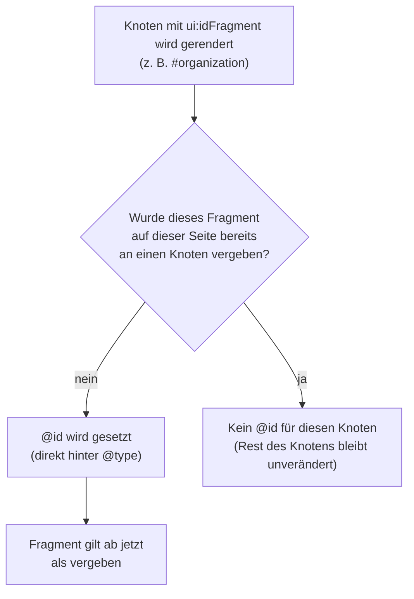

# Use Case: Organisations-Identität und @id-Anker

Ausgewählte Schema-Types erhalten zusätzlich eine stabile `@id` — eine URI,
die den Knoten innerhalb des Datengraphen eindeutig identifiziert.
Erweiterungen (z. B. eine Spendenaktion oder Veranstaltung) können so per
`@id` auf den global definierten Organisationsknoten verweisen, ohne den
Organisationsblock auf jeder Seite zu wiederholen.

```html
<script type="application/ld+json">
{
  "@context": "https://schema.org",
  "@type": "NGO",
  "@id": "https://www.example.org/#organization",
  "name": "Beispiel-Hilfe e. V.",
  "url": "https://www.example.org",
  "nonprofitStatus": "DERegisteredAssociationCharity"
}
</script>
```

## Welche Types bekommen eine @id?

Ob und unter welchem URI-Fragment ein Type eine `@id` bekommt, wird
ausschließlich in der jeweiligen Schema-Datei über die Property
`ui:idFragment` festgelegt — es gibt keine Type-Namen im PHP-Code.

| Fragment | Types | Scope |
|---|---|---|
| `#organization` | `NGO`, `Organization`, `LocalBusiness`, `ProfessionalService`, `LegalService`, `MedicalBusiness`, `AccountingService` | Global |
| `#person` | `Person` | Global |

Die LocalBusiness-Familie teilt sich mit **NGO**/**Organization** bewusst
dasselbe Fragment (`organization`) — es geht um dieselbe Rolle
(„wer betreibt die Website"), unabhängig vom konkret gewählten Type.

## De-Dup-Guard

<details>
<summary>Diagramm: Prüfablauf des De-Dup-Guards je @id-Fragment</summary>



</details>

Pro Seite trägt **genau ein** Knoten ein gegebenes Fragment. Sind auf
derselben Seite z. B. sowohl **NGO** als auch **Organization** global
konfiguriert (was laut [Best Practices](../best-practices.md) ohnehin
vermieden werden sollte), erhält nur der in Ausgabereihenfolge erste Knoten
die `@id` — die übrigen bleiben ohne Anker. Eine einmal gesetzte `@id` wird
nie still entfernt; sie steht immer direkt hinter `@type` im Output.

Die Fragmente `#organization` und `#person` sind vollständig unabhängig
voneinander — De-Dup-Guard und Dangling-Reference-Guard (siehe
[widgets.md](../widgets.md)) greifen für jedes Fragment separat.

## Person-Fragment (`#person`)

`Person` erhält analog zu **NGO**/**Organization** einen eigenen `@id`-Anker
mit dem Fragment `person`. Damit können Seiten-Typen (z. B.
`Event.organizer`) auf eine global definierte Person verweisen. `Person`
ist ausschließlich auf dem **Global-Scope** verfügbar (kein
Kategorie-Scope) — analog zu `NGO`.

```html
<script type="application/ld+json">
{
  "@context": "https://schema.org",
  "@type": "Person",
  "@id": "https://www.example.org/#person",
  "name": "Dr. Maria Beispiel",
  "jobTitle": "Geschäftsführerin"
}
</script>
```

## Basis-URL

Die absolute Basis-URL wird zur Ausgabezeit aus dem aktuellen Request
abgeleitet (Protokoll + Host + Pfad), analog zur kanonischen URL des
moziloCMS-Kerns. Das Plugin besitzt **kein** eigenes Domain-Setting; damit
die `@id` stabil und eindeutig bleibt, sollte die Installation per
`.htaccess` auf einen kanonischen Host umleiten (z. B. 301 auf den
`www`-Host und auf HTTPS). Lässt sich kein Host ermitteln, wird **keine**
(leere) `@id` ausgegeben.

> ⚠️ Ohne kanonische Host-Weiterleitung kann dieselbe Organisation je nach
> aufgerufener URL-Variante (`http://` vs. `https://`, mit/ohne `www`) mit
> unterschiedlichen `@id`-Werten ausgegeben werden. Für Suchmaschinen ist
> das kein Fehler, verwässert aber die Eindeutigkeit des Knotens im
> Datengraphen. Empfehlung: einheitliche 301-Weiterleitung auf genau eine
> Host-Variante.

## Praxisbeispiel: Verein mit Spendenseite und Event

```
Global:  NGO                    → @id: .../#organization
Seite A: DonateAction            → recipient: { "@id": ".../#organization" }
Seite B: Event, organizer=Person → { "@id": ".../#person" } oder Direkteingabe
```

Mechanik und Formularverhalten der Widgets, die diese Referenzen erzeugen
(`id_reference`, `id_reference_or_literal`), stehen in
[widgets.md](../widgets.md).

## Siehe auch

- [../../README.md](../../README.md#organisations-identitaet) — Kurzübersicht
- [../widgets.md](../widgets.md) — `id_reference` / `id_reference_or_literal`, Dangling-Reference-Guard
- [donate-action.md](donate-action.md), [event.md](event.md) — Types, die per `@id` referenzieren
- [../best-practices.md](../best-practices.md) — „genau eine Organisations-Identität global"
