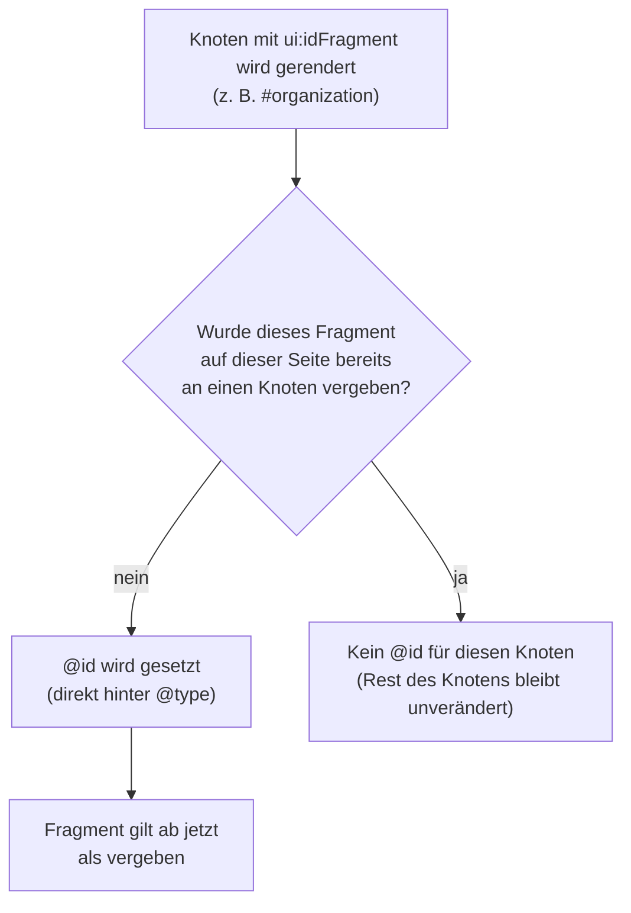

# Use Case: Organisations-Identität und @id-Anker

Ausgewählte Schema-Types erhalten zusätzlich eine stabile `@id` — eine URI,
die den Knoten innerhalb des Datengraphen eindeutig identifiziert.
Erweiterungen (z. B. eine Spendenaktion oder Veranstaltung) können so per
`@id` auf den global definierten Organisationsknoten verweisen, ohne den
Organisationsblock auf jeder Seite zu wiederholen.

```html
<script type="application/ld+json">
{
  "@context": "https://schema.org",
  "@type": "NGO",
  "@id": "https://www.example.org/#organization",
  "name": "Beispiel-Hilfe e. V.",
  "url": "https://www.example.org",
  "nonprofitStatus": "DERegisteredAssociationCharity"
}
</script>
```

## Welche Types bekommen eine @id?

Ob und unter welchem URI-Fragment ein Type eine `@id` bekommt, wird
ausschließlich in der jeweiligen Schema-Datei über die Property
`ui:idFragment` festgelegt — es gibt keine Type-Namen im PHP-Code. Eine
Ausnahme bilden Registry-Personen (siehe unten): ihr Fragment wird nicht
schema-statisch, sondern dynamisch aus dem Slug gebildet.

| Fragment | Types / Quelle | Scope |
|---|---|---|
| `#organization` | `NGO`, `Organization`, `LocalBusiness`, `ProfessionalService`, `LegalService`, `MedicalBusiness`, `AccountingService` | Global |
| `#person-{slug}` | Registry-Personen (`persons_registry`), ein Fragment je Slug | über Referenzierung (Artikel-Autor, `Event.organizer`, `ProfilePage.mainEntity`, Organisations-Relationen) |

Die LocalBusiness-Familie teilt sich mit **NGO**/**Organization** bewusst
dasselbe Fragment (`organization`) — es geht um dieselbe Rolle
(„wer betreibt die Website"), unabhängig vom konkret gewählten Type.

## De-Dup-Guard

<details>
<summary>Diagramm: Prüfablauf des De-Dup-Guards je @id-Fragment</summary>



</details>

Pro Seite trägt **genau ein** Knoten ein gegebenes `#organization`-Fragment.
Sind auf derselben Seite z. B. sowohl **NGO** als auch **Organization**
global konfiguriert (was laut [Best Practices](../best-practices.md)
ohnehin vermieden werden sollte), erhält nur der in Ausgabereihenfolge
erste Knoten die `@id` — die übrigen bleiben ohne Anker. Eine einmal
gesetzte `@id` wird nie still entfernt; sie steht immer direkt hinter
`@type` im Output.

`#person-{slug}` ist demgegenüber eine **Mehrknoten-Fragmentfamilie**: Da
jeder Slug eindeutig ist, kann eine Seite gleichzeitig mehrere
`#person-{slug}`-Knoten tragen (z. B. Artikel-Autor UND
`Event.organizer` als unterschiedliche Personen) — der De-Dup-Guard greift
hier pro Slug, nicht pro Type.

Die Fragmente `#organization` und `#person-{slug}` sind vollständig
unabhängig voneinander — De-Dup-Guard und Dangling-Reference-Guard (siehe
[widgets.md](../widgets.md)) greifen für jedes Fragment separat.

## Registry-Personen (`#person-{slug}`)

Personen werden nicht als eigenständiger Schema-Type konfiguriert, sondern
in einem vierten, von Global/Kategorie/Seite unabhängigen Admin-Bereich
verwaltet (`persons_registry`-Settings-Key). Jede Person erhält bei
tatsächlicher Referenzierung einen eigenen `@id`-Anker mit dem Fragment
`person-{slug}` und wird als eigenständiger `Person`-JSON-LD-Knoten
emittiert:

```html
<script type="application/ld+json">
{
  "@context": "https://schema.org",
  "@type": "Person",
  "@id": "https://www.example.org/#person-maria-beispiel",
  "name": "Dr. Maria Beispiel",
  "jobTitle": "Geschäftsführerin",
  "knowsAbout": ["Steuerrecht", "Unternehmensberatung"]
}
</script>
```

`knowsAbout` ist ein optionales, mehrzeiliges Freitextfeld (ein
Themengebiet je Zeile) und wird bei jeder Personen-Emission mit
ausgegeben, unabhängig davon, über welchen der vier Referenz-Mechanismen
die Person referenziert wurde.

Referenzierbar sind Registry-Personen über vier Mechanismen: die
Autoren-Auswahl von `Article.author` (neben Organisation-Referenz und
Gast-Autor als Literal), `Event.organizer`, `ProfilePage.mainEntity`
(ausschließlich Personen, siehe [profilseite.md](profilseite.md)) sowie die
Organisations-Relationen (`founder`/`employee`/`member`, siehe
[widgets.md](../widgets.md)). Nur **aktive** Personen erscheinen in den
zugehörigen Auswahl-Dropdowns; eine bereits gespeicherte Referenz auf eine
inzwischen inaktive Person bleibt bei Artikel-Autor und
`Event.organizer` weiterhin sichtbar, wird aber in den
Organisations-Relationen aus der Ausgabe gefiltert (Details:
[Personen-Registry](../../README.md#personen-registry)).

Ergänzend referenziert `Article.publisher` per `id_reference` auf
`organization` — anders als `author` ohne Auswahlmodus, ausschließlich als
Organisationsverweis (siehe [widgets.md](../widgets.md)).

## Übernahme aus dem Erweiterungsfeld (`employee`/`founder`/`member`)

Enthält das Erweiterungsfeld eines global konfigurierten
Organisations-Identity-Types (Fragment `organization`) einen der drei
Top-Level-Keys `employee`, `founder` oder `member` als **einzelnes**
Objekt vom Typ `Person` (typischer Fall: Import eines bestehenden
JSON-LD-Blocks, der eine Person enthält, die keinem Schema-Feld des Types
entspricht), bietet das Plugin eine Übernahme in die Personen-Registry an,
statt die Rohdaten dauerhaft im Erweiterungsfeld zu belassen.

Der Namensabgleich (`name`-Wert, Trim-String-Gleichheit gegen alle
Registry-Personen unabhängig vom Status) entscheidet über den
Übernahme-Weg: bei Treffer wird die bestehende Person für eine neue
Organisations-Relation verwendet (kein Duplikat, falls dieselbe
Person/Rolle-Kombination bereits verlinkt ist), ohne Treffer legt das
Plugin eine neue Registry-Person mit den Feldern aus dem Literal an
(`name`, `honorificPrefix`, `jobTitle`, `description`, `url`, `image`,
`sameAs`) samt passender Organisations-Relation. In beiden Fällen wird die
übernommene Property danach aus dem Erweiterungsfeld entfernt.

<a id="basis-url"></a>
## Basis-URL

Die absolute Basis-URL wird zur Ausgabezeit aus dem aktuellen Request
abgeleitet (Protokoll + Host + Pfad), analog zur kanonischen URL des
moziloCMS-Kerns. Das Plugin besitzt **kein** eigenes Domain-Setting; damit
die `@id` stabil und eindeutig bleibt, sollte die Installation per
`.htaccess` auf einen kanonischen Host umleiten (z. B. 301 auf den
`www`-Host und auf HTTPS). Lässt sich kein Host ermitteln, wird **keine**
(leere) `@id` ausgegeben.

> ⚠️ Ohne kanonische Host-Weiterleitung kann dieselbe Organisation je nach
> aufgerufener URL-Variante (`http://` vs. `https://`, mit/ohne `www`) mit
> unterschiedlichen `@id`-Werten ausgegeben werden. Für Suchmaschinen ist
> das kein Fehler, verwässert aber die Eindeutigkeit des Knotens im
> Datengraphen. Empfehlung: einheitliche 301-Weiterleitung auf genau eine
> Host-Variante.

## Praxisbeispiel: Verein mit Spendenseite, Event und Autoren-Referenz

```
Global:  NGO                     → @id: .../#organization
Seite A: DonateAction             → recipient: { "@id": ".../#organization" }
Seite B: Event, organizer=Person  → { "@id": ".../#person-maria-beispiel" }
Artikel: author=Registry-Person   → { "@id": ".../#person-julia-weber" }
```

Mechanik und Formularverhalten der Widgets, die diese Referenzen erzeugen
(`id_reference`, `id_reference_or_literal`), stehen in
[widgets.md](../widgets.md).

## Siehe auch

- [../../README.md](../../README.md#organisations-identitaet) — Kurzübersicht
- [../widgets.md](../widgets.md) — `id_reference` / `id_reference_or_literal`, Dangling-Reference-Guard
- [donate-action.md](donate-action.md), [event.md](event.md) — Types, die per `@id` referenzieren
- [../best-practices.md](../best-practices.md) — „genau eine Organisations-Identität global"
